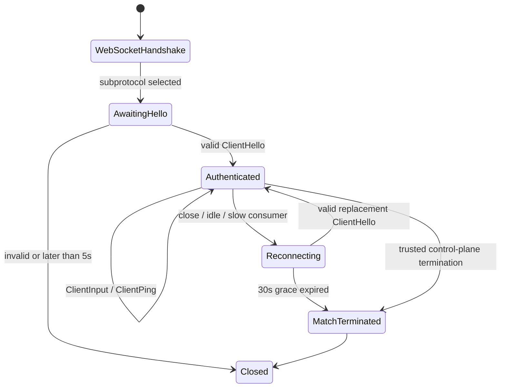
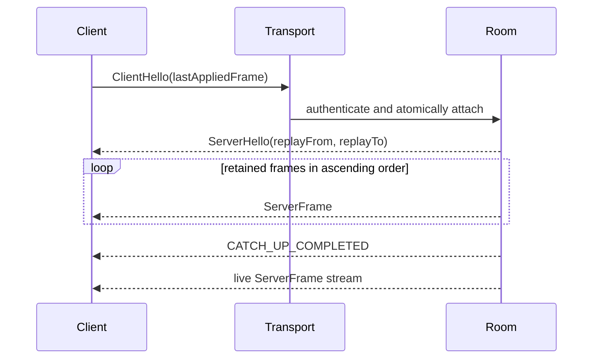

# Lockstep Data Plane Protocol v1

This document defines the engine-neutral wire contract between the lockstep
server and clients built with Unreal Engine, Unity, Cocos, or any other runtime.
The canonical message schema is
[`src/main/proto/lockstep_v1.proto`](../src/main/proto/lockstep_v1.proto).

## Transport and framing

- Transport is RFC 6455 WebSocket at `/game`.
- The client must offer the `lockstep.protobuf.v1` WebSocket subprotocol. The
  server must select that exact value or reject the upgrade.
- Every WebSocket binary message contains exactly one serialized
  `lockstep.v1.Envelope`. Text messages, fragmented payloads exceeding the
  configured 64 KiB aggregate limit, and invalid Protobuf messages are rejected.
- `Envelope.protocol_version` must be `1`. The sender may set `request_id` for
  correlation. A direct response, including `ServerPong` or `ProtocolError`,
  copies it when one was supplied; unsolicited frames and events may leave it
  empty.
- Tickets are carried only in `ClientHello`. They must not be put in the URI,
  query string, subprotocol header, or logs.

All frame identifiers and message sequence numbers are unsigned 32-bit values.
Clients must use an unsigned representation or preserve the underlying 32 bits
when their language has no native `uint32`. Game input is opaque `bytes`; the
room server never decodes engine-specific objects.

## Connection and authentication

After the WebSocket upgrade, the connection is unauthenticated:

1. The client sends one `ClientHello` within 5 seconds. No other application
   message is valid before it.
2. The server validates protocol version, room, match, reserved player, ticket
   signature, ticket expiry, and the room's active state.
3. The server binds the connection to that exact player and returns
   `ServerHello`.
4. An initial connection sends `last_applied_frame = 0`. A reconnect sends the
   last `ServerFrame.frame_id` that the client completely applied.

Authentication failure is fatal. A second `ClientHello` on an authenticated
connection is also fatal; reconnecting requires a new WebSocket. If the same
player authenticates on a new connection, the new session atomically replaces
the old one. Closing the replaced connection must not mark the new session as
disconnected.

`ServerHello` reports the current match phase and frame parameters. Its
`replay_from_frame` and `replay_to_frame` form an inclusive range. Both are zero
when no replay follows. It also carries the authoritative
`client_ping_interval_ms`, `connection_idle_timeout_ms`, and
`reconnect_grace_ms` values so clients do not hard-code deployment settings.



## Client heartbeat and disconnect detection

Heartbeat is initiated only by the authenticated client:

- The client sends `ClientPing` every 5 seconds on a fixed schedule, regardless
  of whether it sent inputs or other messages during that interval.
- The server immediately replies with `ServerPong`, echoing both
  `ClientPing.sequence` and the envelope `request_id` when present.
- The server does not initiate either an application-level Ping or a WebSocket
  Ping as the protocol heartbeat.
- Every successfully decoded, client-to-server message from the authenticated
  current connection refreshes its last-inbound time. A well-formed input that
  is later rejected for its target frame or payload still proves connection
  activity. Malformed, unauthenticated, and wrong-direction messages do not
  refresh it.
- If 15 seconds elapse without a valid authenticated message, the server closes
  that connection with `HEARTBEAT_TIMEOUT` semantics and marks the player
  `RECONNECTING`.

Heartbeat and timeout measurement use a monotonic clock. The 15-second
connection timeout is distinct from the reconnect grace period.

## Reconnect and replay

After a connection is lost, the match continues and the server emits no-op input
for that player. The player has 30 seconds from disconnect detection to
authenticate a replacement connection.

For a valid reconnect:

1. The room takes a snapshot of its current frame on its event loop.
2. If the client is behind, `ServerHello` advertises
   `[last_applied_frame + 1, snapshot_frame]`.
3. The server sends every retained `ServerFrame` in that range in ascending
   order without interleaving newer live frames.
4. It emits `EVENT_TYPE_CATCH_UP_COMPLETED`, then switches the session to the
   live stream. Live frames produced during replay are queued in order.

The default history is 1,000 frames (50 seconds at 20 Hz). If the requested
first frame has already been evicted, the server sends the fatal
`PROTOCOL_ERROR_CODE_REPLAY_HISTORY_EXPIRED` error and terminates the match to
avoid deterministic state divergence. A reconnect grace timeout also terminates
the match.



## Frame and input rules

- The match starts at frame 1 when all reserved players are connected.
- The default rate is 20 frames per second. `ServerHello` is authoritative for
  `tick_rate`, `input_delay_frames`, and `max_lead_frames`.
- With the defaults, a `ClientInput.target_frame` is accepted only in the
  inclusive range `current_frame + 1` through `current_frame + 4`; clients
  normally target `current_frame + 2`.
- `ClientInput.sequence` is monotonically increasing per player and must be
  nonzero. `payload` is at most 1 KiB.
- The first valid input from a player for a target frame wins. An exact retry
  with the same sequence and bytes is idempotently ignored. Any different input
  for that player and frame is rejected as
  `PROTOCOL_ERROR_CODE_DUPLICATE_INPUT`.
- A late, too-far-ahead, or otherwise invalid target is rejected as
  `PROTOCOL_ERROR_CODE_INVALID_TARGET_FRAME`. A rejected input never changes a
  previously accepted or broadcast frame.
- Each `ServerFrame.inputs` list follows the immutable player order from the
  room allocation. If a player has no accepted input, the entry has
  `no_op = true`, `sequence = 0`, and an empty payload.
- Once broadcast, a `ServerFrame` is immutable. The server does not execute the
  payload, simulate the game, or decide the winner.

The server schedules ticks using a monotonic clock. A delayed event loop neither
bursts several catch-up ticks nor skips frame identifiers.

## Events and errors

`MatchEvent` communicates lifecycle changes:

- `EVENT_TYPE_MATCH_STARTED`
- `EVENT_TYPE_PLAYER_DISCONNECTED`
- `EVENT_TYPE_PLAYER_RECONNECTED`
- `EVENT_TYPE_CATCH_UP_COMPLETED`
- `EVENT_TYPE_MATCH_TERMINATING`
- `EVENT_TYPE_MATCH_ENDED`

`player_id` is populated only for player-specific events. `reason` is a stable
machine-readable token. Clients must not use the data plane to end a match;
normal termination is initiated by the trusted REST control plane.

`ProtocolError.fatal = false` rejects only the offending message. When it is
`true`, the server sends the error and closes the WebSocket. Authentication,
unsupported protocol, expired replay history, malformed envelopes that cannot
be safely processed, and invalid message direction are fatal. Frame-window,
payload-size and duplicate-input errors are non-fatal.

## Compatibility rules

- The WebSocket subprotocol and `Envelope.protocol_version` jointly select the
  protocol major version. A breaking wire or behavioral change requires v2 and
  a new subprotocol such as `lockstep.protobuf.v2`.
- Existing field numbers, enum numbers, and their meanings are permanent. They
  must never be reused, even after a field or value is removed; removed numbers
  and names must be marked `reserved` in the schema.
- Backward-compatible v1 evolution may add optional scalar fields, messages,
  enum values, or new `oneof` alternatives using new numbers.
- Receivers must tolerate unknown fields and unknown enum numeric values.
  Unknown `Envelope.payload` alternatives cannot be acted upon and should
  produce an unsupported-message error without assuming their contents.
- Senders must not rely on proto3 scalar presence unless a field is explicitly
  declared `optional`. Zero values have the meanings documented in the schema.
- Implementations must generate code from the canonical `.proto` file. They
  must not duplicate the wire layout with engine-specific serializers.

## Compatibility test vectors

Canonical Protobuf binary fixtures are stored in
[`src/test/resources/protocol-v1`](../src/test/resources/protocol-v1). The set
contains `ClientHello`, `ClientPing`, `ServerPong`, and a `ServerFrame` with
both a real input and a no-op. `manifest.json` records the decoded fields, exact
wire hex, and SHA-256 digest for each file.

An engine implementation is compatible when it can parse every `.bin` file into
the manifest values and serialize those parsed messages back to exactly the
same bytes. The Java compatibility test enforces both directions. Regenerate
the fixtures intentionally from the repository root with:

```powershell
$env:GENERATE_PROTOCOL_VECTORS = 'true'
.\gradlew.bat test --tests 'com.rainnov.lockstep.protocol.ProtocolV1TestVectorGeneratorTest'
```

Generation is disabled during ordinary test runs so a schema change cannot
silently rewrite the compatibility baseline.
