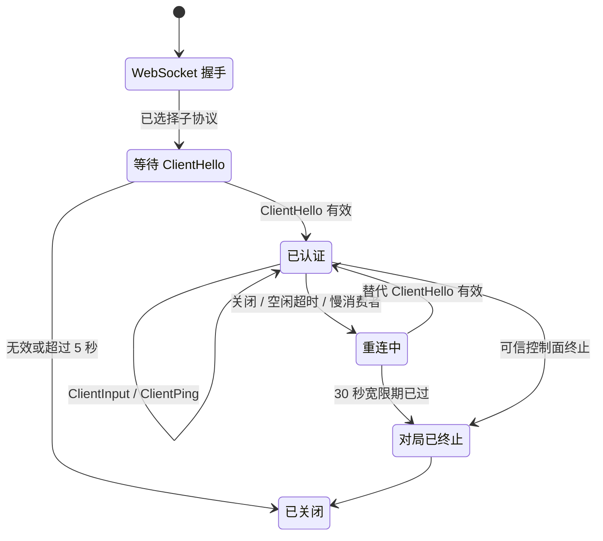
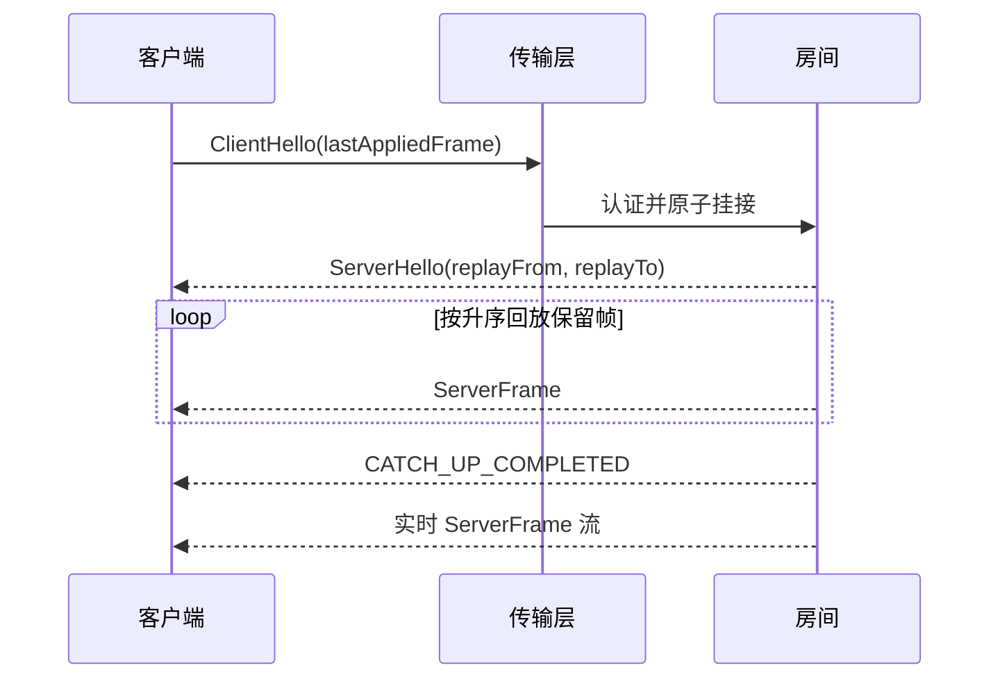

# 帧同步数据面协议 v1

本文档定义帧同步服务端与 Unreal Engine、Unity、Cocos 或其他运行时客户端之间与引擎无关的传输契约。标准消息模式定义见 [`src/main/proto/lockstep_v1.proto`](../src/main/proto/lockstep_v1.proto)。

## 传输与分帧

- 传输层采用 RFC 6455 WebSocket，路径为 `/game`。
- 客户端必须提供 `lockstep.protobuf.v1` WebSocket 子协议。服务端必须选择该精确值，否则拒绝升级。
- 每条 WebSocket 二进制消息仅包含一个序列化后的 `lockstep.v1.Envelope`。文本消息、聚合后超过所配置 64 KiB 上限的分片载荷，以及无效的 Protobuf 消息都会被拒绝。
- `Envelope.protocol_version` 必须为 `1`。发送方可以设置 `request_id` 以关联请求和响应。直接响应（包括 `ServerPong` 或 `ProtocolError`）会在请求提供该字段时复制其值；服务端主动发送的帧和事件可以将其留空。
- 票据只能放在 `ClientHello` 中，不能放入 URI、查询字符串、子协议请求头或日志。

所有帧标识符和消息序列号均为 32 位无符号值。客户端应使用无符号表示；如果所用语言没有原生 `uint32`，则必须保留底层的 32 位数据。游戏输入是不透明的 `bytes`，房间服务端不会解码引擎专属对象。

## 连接与认证

WebSocket 升级完成后，连接处于未认证状态：

1. 客户端必须在 5 秒内发送一条 `ClientHello`，此前发送的其他应用层消息均无效。
2. 服务端校验协议版本、房间、对局、预留玩家、票据签名、票据有效期以及房间的活动状态。
3. 服务端将连接绑定到该玩家并返回 `ServerHello`。
4. 首次连接发送 `last_applied_frame = 0`；重连时发送客户端已完整应用的最后一个 `ServerFrame.frame_id`。

认证失败属于致命错误。已认证连接再次发送 `ClientHello` 同样属于致命错误；重连必须创建新的 WebSocket。如果同一玩家在新连接上认证成功，新会话会原子替换旧会话。关闭被替换的连接时，不得将新会话标记为断线。

`ServerHello` 会报告当前对局阶段和帧参数。`replay_from_frame` 与 `replay_to_frame` 构成闭区间；无需回放时二者均为零。它还会携带本次分配的权威参数 `client_ping_interval_ms`、`connection_idle_timeout_ms` 和 `reconnect_grace_ms`，客户端不得将部署参数写死。



## 客户端心跳与断线检测

心跳仅由已认证客户端发起：

- 客户端固定每 5 秒发送一次 `ClientPing`，无论该周期内是否发送过输入或其他消息。
- 服务端立即返回 `ServerPong`，原样带回 `ClientPing.sequence`；如果信封中存在 `request_id`，也会原样带回。
- 服务端不会主动发送应用层 Ping 或 WebSocket Ping 作为协议心跳。
- 当前已认证连接上每条成功解码的客户端到服务端消息都会刷新其最后入站时间。格式正确但因目标帧或载荷问题被拒绝的输入仍可证明连接处于活动状态；格式错误、未认证或方向错误的消息不会刷新该时间。
- 如果连续 15 秒未收到有效的已认证消息，服务端会以 `HEARTBEAT_TIMEOUT` 语义关闭连接，并将玩家标记为 `RECONNECTING`。

心跳与超时测量使用单调时钟。15 秒连接超时与重连宽限期相互独立。

## 重连与回放

连接断开后，对局继续进行，服务端会为该玩家填充空操作输入。从检测到断线开始，玩家有 30 秒时间认证替代连接。

有效重连的处理流程如下：

1. 房间在其事件循环上获取当前帧快照。
2. 如果客户端落后，`ServerHello` 会声明 `[last_applied_frame + 1, snapshot_frame]`。
3. 服务端按升序发送该范围内所有保留的 `ServerFrame`，期间不会交错发送更新的实时帧。
4. 服务端发送 `EVENT_TYPE_CATCH_UP_COMPLETED`，然后将会话切换至实时流。回放期间生成的实时帧会按顺序排队。

默认历史记录为 1,000 帧（20 Hz 下为 50 秒）。如果请求的首帧已被淘汰，服务端会发送致命错误 `PROTOCOL_ERROR_CODE_REPLAY_HISTORY_EXPIRED` 并终止对局，以避免确定性状态分歧。重连宽限期超时也会终止对局。



## 帧与输入规则

- 所有预留玩家连接后，对局从第 1 帧开始。
- 默认速率为每秒 20 帧。`tick_rate`、`input_delay_frames` 和 `max_lead_frames` 均以 `ServerHello` 返回的值为准。
- 使用默认值时，仅接受目标位于闭区间 `current_frame + 1` 到 `current_frame + 4` 内的 `ClientInput.target_frame`；客户端通常以 `current_frame + 2` 为目标。
- 每位玩家的 `ClientInput.sequence` 必须单调递增且不能为零。`payload` 最大为 1 KiB。
- 某位玩家针对目标帧发送的第一条有效输入生效。序列号和字节完全相同的重试会被幂等忽略；该玩家针对同一帧发送的任何不同输入都会以 `PROTOCOL_ERROR_CODE_DUPLICATE_INPUT` 拒绝。
- 迟到、过度超前或其他无效目标都会以 `PROTOCOL_ERROR_CODE_INVALID_TARGET_FRAME` 拒绝。被拒绝的输入不会更改此前已接受或已广播的帧。
- 每个 `ServerFrame.inputs` 列表都遵循房间分配时确定且不可变的玩家顺序。如果某位玩家没有已接受的输入，对应条目为 `no_op = true`、`sequence = 0` 且载荷为空。
- `ServerFrame` 一经广播便不可更改。服务端不会执行载荷、模拟游戏或判定胜负。

服务端使用单调时钟调度 tick。事件循环发生延迟时，既不会突发执行多个追赶 tick，也不会跳过帧标识符。

## 事件与错误

`MatchEvent` 用于传达生命周期变化：

- `EVENT_TYPE_MATCH_STARTED`
- `EVENT_TYPE_PLAYER_DISCONNECTED`
- `EVENT_TYPE_PLAYER_RECONNECTED`
- `EVENT_TYPE_CATCH_UP_COMPLETED`
- `EVENT_TYPE_MATCH_TERMINATING`
- `EVENT_TYPE_MATCH_ENDED`

`player_id` 仅在玩家专属事件中填写。`reason` 是稳定、机器可读的标记。客户端不得通过数据面结束对局；正常终止由可信的 REST 控制面发起。

`ProtocolError.fatal = false` 只拒绝触发错误的消息。该值为 `true` 时，服务端会发送错误并关闭 WebSocket。认证失败、不支持的协议、回放历史过期、无法安全处理的畸形 `Envelope` 以及无效消息方向均属于致命错误。帧窗口、载荷大小和重复输入错误属于非致命错误。

## 兼容规则

- WebSocket 子协议与 `Envelope.protocol_version` 共同选择协议主版本。传输格式或行为发生破坏性变更时必须升级到 v2，并使用 `lockstep.protobuf.v2` 等新子协议。
- 现有字段编号、枚举编号及其含义永久有效，即使字段或值已移除也不得复用；已移除的编号和名称必须在模式定义中标记为 `reserved`。
- v1 的向后兼容演进可以使用新编号增加可选标量字段、消息、枚举值或新的 `oneof` 选项。
- 接收方必须容忍未知字段和未知枚举数值。无法处理未知的 `Envelope.payload` 选项时，应返回不支持消息错误，不得臆测其内容。
- 除非字段显式声明为 `optional`，否则发送方不得依赖 proto3 标量字段的存在性。零值的含义以模式定义中的说明为准。
- 各实现必须根据标准 `.proto` 文件生成代码，不得使用引擎专属序列化器重复定义传输格式。

## 兼容性测试向量

标准 Protobuf 二进制样例存放在 [`src/test/resources/protocol-v1`](../src/test/resources/protocol-v1)。其中包含 `ClientHello`、`ClientPing`、`ServerPong`，以及同时带有真实输入和空操作的 `ServerFrame`。`manifest.json` 记录每个文件解码后的字段、精确的传输编码十六进制数据和 SHA-256 摘要。

引擎实现能够将每个 `.bin` 文件解析为清单中的值，并将解析后的消息重新序列化为完全相同的字节时，即视为兼容。Java 兼容性测试会验证两个方向。如需重新生成样例，请在仓库根目录中明确执行：

```powershell
$env:GENERATE_PROTOCOL_VECTORS = 'true'
.\gradlew.bat test --tests 'com.rainnov.lockstep.protocol.ProtocolV1TestVectorGeneratorTest'
```

普通测试默认禁用生成操作，避免模式定义变更在无提示的情况下重写兼容性基线。
