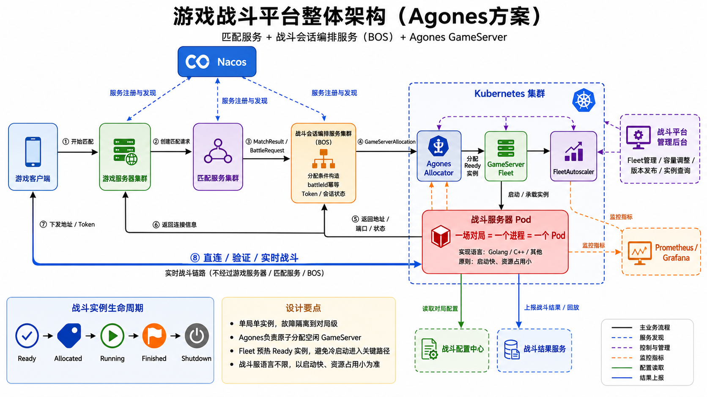

# 游戏战斗平台整体架构说明（Agones方案）

> 文档状态：已确认方案汇总  
> 适用范围：多游戏、多区域、多版本的实时对战平台  
> 核心模型：一场对局 = 一个战斗服务器进程 = 一个 Agones GameServer = 一个 Kubernetes Pod

## 1. 方案摘要

本方案以 Kubernetes 和 Agones 承载专用战斗服务器，将传统“一个常驻战斗服进程管理多个房间”的模型改造为“单局单进程单 Pod”的战斗会话模型。

平台的核心职责边界为：

```text
匹配服务：决定谁和谁打

BOS：决定这场对局需要什么资源，并编排完整战斗会话

Agones：按 BOS 给出的条件，原子分配具体的 Ready GameServer

Kubernetes：决定 GameServer Pod 运行在哪个计算节点

战斗服务器：负责本场对局具体如何运行
```

战斗服务器实现语言不作强制限定，可使用 Go、C++、Rust 或其他能够接入 Agones SDK/接口的语言。最终选择以启动速度、常驻内存、CPU 效率、实时性、稳定性和团队工程效率为依据。

## 2. 架构目标

### 2.1 业务目标

- 支持多款游戏共享统一的匹配、战斗会话编排和运行平台。
- 支持按游戏、模式、区域、版本及资源规格隔离战斗实例。
- 支持玩家快速进入战斗，避免将 Pod 冷启动放在玩家等待的关键路径中。
- 支持战斗服多版本共存、灰度发布和快速回滚。
- 支持对局、玩家、结果、回放与实际 GameServer 实例的全链路查询。

### 2.2 技术目标

- 一场对局只运行在一个独立战斗进程中，降低故障影响范围。
- 消除战斗服务器进程内部的多房间管理和跨对局资源争用。
- 通过 Agones Fleet 预热 GameServer，通过原子 Allocation 防止重复分配。
- 通过 FleetAutoscaler 和 Kubernetes 节点伸缩实现双层弹性。
- 将短生命周期战斗实例与长期运行的业务服务发现体系分离。
- 对分配、初始化、连接、运行、结果提交和销毁进行可观测、可审计的生命周期管理。

### 2.3 非目标

- BOS 不自行扫描空闲 Pod，也不实现一套与 Agones 重复的实例调度器。
- Nacos 不用于发现短生命周期 GameServer Pod。
- 游戏客户端不感知 Nacos、Agones、Fleet、Pod 或 Kubernetes。
- 实时战斗流量不经过游戏服务器、匹配服务或 BOS 转发。
- 管理后台不直接向浏览器暴露 Kubernetes API，也不允许任意编辑集群 YAML。

## 3. 整体架构



架构分为四个平面：

1. **业务控制面**：游戏客户端、游戏服务器、匹配服务、BOS。
2. **战斗运行面**：Agones Allocator、Fleet、FleetAutoscaler、GameServer Pod、Kubernetes 节点池。
3. **平台支撑面**：Nacos、战斗配置服务、战斗结果服务、回放/消息系统、可观测平台。
4. **运维与运营管理面**：战斗平台管理后台、战斗平台控制服务、GitOps/发布系统。

实时数据面单独存在：

```text
游戏客户端 ⇄ GameServer Pod
```

客户端获得连接地址、端口和 Token 后直连战斗实例，实时战斗数据不经过 BOS。

## 4. 核心组件职责

### 4.1 游戏客户端

负责：

- 向游戏服务器请求开始匹配、取消匹配。
- 接收战斗实例地址、端口、协议和连接 Token。
- 直连 GameServer Pod。
- 完成身份及对局验证。
- 与战斗服务器进行实时数据交互。
- 处理断线、重连及战斗结束通知。

不负责：

- 不注册或查询 Nacos。
- 不调用 Agones Allocator。
- 不感知 Fleet、GameServer 名称、Pod 名称或 Kubernetes 节点。

### 4.2 游戏服务器集群

负责：

- 玩家登录、组队、门票、体力、版本等业务校验。
- 创建和取消匹配请求。
- 维护玩家“匹配中、战斗中、结算中”等业务状态。
- 接收 BOS 返回的连接信息并下发给客户端。
- 接收战斗结果，更新玩家长期业务数据。
- 处理匹配取消、超时、重复请求和异常补偿入口。

不负责匹配池扫描、具体 GameServer 分配、Pod 生命周期或实时战斗流量转发。

### 4.3 匹配服务集群

负责解决“谁和谁打”：

- 按 `gameId`、`modeId`、`regionId`、版本等维度维护匹配队列。
- 处理单人及队伍的进入、退出和超时。
- 执行 MMR、段位、延迟、人数、阵营平衡、扩圈和机器人补位等规则。
- 生成唯一 `matchId` 和 `battleId`。
- 输出完整的 `MatchResult`，提交给 BOS。

匹配服务不选择 Fleet 或 GameServer，不处理 Kubernetes 资源调度。

### 4.4 战斗会话编排服务集群（BOS）

BOS 全称保留为 **Battle Orchestrator Service**，中文定位由原“战斗调度服务”调整为：

> **战斗会话编排服务**

BOS 管理的不只是一个 Pod，而是从匹配完成到结果落地的完整业务战斗会话。

#### BOS 负责

- 接收 `MatchResult`。
- 根据游戏、区域、版本、协议和资源规格生成 Allocation 条件。
- 以 `battleId` 作为幂等键，防止重复分配。
- 调用 Agones Allocator 或创建 `GameServerAllocation`。
- 在分配时写入少量上下文，如 `battleId`、`configKey`、`traceId`。
- 保存 `battleId → GameServer → 地址/端口` 映射。
- 生成或协调鉴权服务生成玩家连接 Token。
- 将连接信息返回游戏服务器。
- 维护业务侧战斗会话状态。
- 处理分配失败、超时、有限重试、兼容版本回退和备用区域策略。
- 对账 BOS 业务状态与 Agones GameServer 状态。
- 识别并处理孤儿实例、悬挂会话和异常结果。
- 为管理后台聚合对局、实例、结果、日志和回放关联信息。

#### BOS 不负责

- 不查询全量 GameServer 后自行选择具体实例。
- 不比较具体 Pod 的 CPU、内存并自行加锁分配。
- 不将 GameServer 手工修改为 `Allocated`。
- 不维护 Ready 实例池。
- 不直接创建、删除或重启战斗 Pod。
- 不自行实现 Fleet 扩缩容。
- 不转发实时战斗流量。

Agones 的 `GameServerAllocation` 会从满足条件的集合中原子选择实例，并在成功后将其转为 `Allocated`，因此这部分能力不应在 BOS 中重复实现。参见 [Agones GameServerAllocation 规范](https://agones.dev/site/docs/reference/gameserverallocation/)。

### 4.5 Agones Allocator / GameServerAllocation

负责：

- 根据状态、标签选择器、表达式和优先级匹配可用 GameServer。
- 原子分配一个符合条件的 `Ready` GameServer。
- 将实例切换为 `Allocated`。
- 返回 GameServer 名称、地址、端口和节点信息。
- 在 Allocation 时向 GameServer 附加受控标签或 Annotation。

若 BOS 位于集群外或需要多集群接入，优先使用提供 gRPC/REST 与 mTLS 的 `agones-allocator`；若 BOS 位于同集群且组织接受 Kubernetes RBAC，也可直接使用 `GameServerAllocation` CRD。参见 [Agones Allocator Service](https://agones.dev/site/docs/advanced/allocator-service/)。

### 4.6 GameServer Fleet

Fleet 是一组可供分配的预热 GameServer。它维护期望实例数，并由 Agones 控制器使实际状态趋近期望状态。参见 [Agones Fleet 规范](https://agones.dev/site/docs/reference/fleet/)。

建议按照以下维度划分 Fleet：

```text
{gameId}-{regionId}-{battleVersion}-{runtimeProfile}
```

示例：

```text
game-a-sg-v1-8-3-standard
game-a-sg-v1-8-3-large
game-b-jp-v2-1-0-standard
```

默认不按每个游戏模式拆分 Fleet。只有当不同模式使用不同镜像、启动参数、资源规格或网络协议时，再单独拆分。

### 4.7 FleetAutoscaler

FleetAutoscaler 根据需求自动调整 Fleet 副本数。

首期推荐：

- 使用 Ready Buffer 维持固定数量或比例的可分配实例。
- 为每个 Fleet 配置最小、最大副本数。
- 监控 Ready 耗尽、Pod 启动时间和 Allocation 失败率。

成熟期可使用 Webhook 策略接入：

- 当前匹配队列长度。
- 每分钟匹配成功数。
- 区域流量趋势。
- 活动计划。
- Pod P95 启动时间。
- 节点扩容耗时。

FleetAutoscaler 的 Ready Buffer 可按绝对数量或百分比维持，Webhook 可将外部业务信号纳入伸缩决策。参见 [Agones FleetAutoscaler 规范](https://agones.dev/site/docs/reference/fleetautoscaler/)。

### 4.8 Kubernetes

负责：

- Pod 调度和容器运行。
- CPU、内存及其他资源隔离。
- 节点故障识别。
- 镜像拉取和节点池伸缩。
- 网络、端口及基础安全策略。
- 日志、指标和运行时基础设施集成。

战斗 Pod 必须通过压测设置合理的 `requests` 与 `limits`。Kubernetes 调度器主要依据 `requests` 判断节点是否还能容纳 Pod；资源值过低会造成节点超卖，过高则会降低装箱率。参见 [Kubernetes Pod 资源管理](https://kubernetes.io/docs/concepts/configuration/manage-resources-containers/)。

### 4.9 战斗服务器进程

每个战斗服务器进程只承载一场对局：

```text
BattleSession
    =
BattleServer Process
    =
Agones GameServer
    =
Kubernetes Pod
```

负责：

- 启动后连接 Agones SDK Server。
- 启动健康上报并完成公共资源预加载。
- 准备完成后调用 `Ready()`。
- 分配后读取 `battleId`、`configKey` 等上下文。
- 加载本场地图、玩家、队伍、规则和随机种子。
- 监听客户端连接并验证 Token。
- 运行 Tick/Event Loop、状态同步、断线重连和反作弊接口。
- 上报指标、日志、关键事件、结果和回放。
- 对局结束并确认关键结果可恢复后调用 `Shutdown()`。

战斗服务器不注册到 Nacos，不在进程内维护多个房间，也不复用进程承载下一场对局。

### 4.10 战斗配置与结果服务

完整玩家列表和大型战斗配置不应放入 Kubernetes Annotation。Allocation 元数据只保存短标识：

```text
battleId
configKey
traceId
gameId
modeId
```

战斗服务器再依据 `configKey` 从独立配置服务或高速缓存读取完整上下文。

战斗结果服务应支持：

- `battleId + resultVersion` 幂等写入。
- 可靠消息或持久化确认。
- 结果重试与对账。
- 回放索引和对象存储关联。
- 结算状态查询。

Pod 销毁前必须满足“结果已确认写入”或“结果已进入可靠、可恢复通道”，不能让唯一结果只存在于进程内存中。

## 5. Nacos 边界

Nacos 只服务于长期运行、相对稳定的后端业务服务。服务提供者注册实例，服务消费者按服务名查询或订阅实例变化；参见 [Nacos 服务发现概述](https://nacos.io/en/docs/latest/manual/user/naming/overview/)。

| 组件 | 是否注册 Nacos | 是否通过 Nacos 发现其他服务 | 说明 |
|---|---:|---:|---|
| 游戏客户端 | 否 | 否 | 客户端只连接游戏服务器及已下发的战斗地址 |
| 游戏服务器 | 是 | 是 | 发现匹配服务、业务服务 |
| 匹配服务 | 是 | 是 | 发现 BOS 等长期业务服务 |
| BOS | 是 | 是 | 发现配置、鉴权、结果等业务服务；通过 Agones 接口分配战斗实例 |
| 战斗配置服务 | 是 | 是 | 长期业务服务 |
| 战斗结果服务 | 是 | 是 | 长期业务服务 |
| 战斗平台控制服务 | 是，可选 | 是 | 按部署和调用关系确定 |
| Agones GameServer Pod | 否 | 否 | 短生命周期实例，由 Agones/Kubernetes 管理 |
| Agones 控制器/Allocator | 否 | 否 | 使用 Kubernetes/Agones 原生服务与安全机制 |

明确禁止两种设计：

```text
游戏客户端 → Nacos
GameServer Pod → 注册 Nacos
```

客户端连接战斗实例的唯一标准路径是：

```text
游戏服务器下发地址、端口、协议和 Token
    ↓
客户端直连 GameServer Pod
```

## 6. 单局单进程单 Pod 与语言策略

### 6.1 单局模型

一场对局结束后，战斗服务器不回到 `Ready` 复用，而是：

1. 完成最终结果和回放投递。
2. 停止接收新的业务数据。
3. 调用 Agones SDK `Shutdown()`。
4. GameServer 进入关闭流程。
5. Pod 终止。
6. Fleet/FleetAutoscaler 补充新的 Ready 实例。

Agones SDK 支持将已分配 GameServer 再次转回 Ready，但本方案基于隔离性、状态清理和可预测性，明确选择“单局结束即销毁”。Agones 对 `Shutdown()` 的说明见 [Game Server Client SDKs](https://agones.dev/site/docs/guides/client-sdks/)。

### 6.2 语言不限定

可按游戏选择不同语言，但必须统一平台协议：

```text
BattleRuntimeAdapter
├── ConnectAgones()
├── StartHealthCheck()
├── Ready()
├── LoadBattleContext()
├── ValidatePlayer()
├── ReportResult()
└── Shutdown()
```

语言评估指标：

- 进程启动到 `Ready` 的 P50/P95/P99 时长。
- 镜像体积、镜像拉取时间和动态库加载时间。
- 空闲/满员常驻内存。
- 单玩家增量内存。
- 空闲/满负载 CPU。
- Tick P50/P95/P99 及超时次数。
- GC 或分配器引起的延迟抖动。
- 网络收发能力与丢包下的稳定性。
- 崩溃转储、性能剖析、调试和团队维护成本。

## 7. 完整业务流程

### 7.1 Fleet 预热

1. Fleet 根据期望副本数创建 GameServer。
2. Kubernetes 调度 Pod 并拉取镜像。
3. 战斗进程启动，连接 Agones SDK Server。
4. 战斗进程启动周期性 Health 上报。
5. 战斗进程加载公共静态资源。
6. 初始化完成后调用 `Ready()`。
7. GameServer 进入 `Ready`，等待分配。

Health 调用间隔必须满足 GameServer 健康策略，否则实例可能进入 `Unhealthy`；参见 [Agones GameServer Health Checking](https://agones.dev/site/docs/guides/health-checking/)。

### 7.2 玩家匹配

1. 客户端向游戏服务器发起匹配请求。
2. 游戏服务器完成玩家、队伍、门票和版本校验。
3. 游戏服务器将请求提交匹配服务。
4. 匹配服务按游戏规则组局。
5. 匹配服务生成 `matchId`、`battleId` 和 `MatchResult`。
6. 匹配服务将 `MatchResult` 提交给 BOS。

### 7.3 战斗会话分配

1. BOS 使用 `battleId` 检查请求幂等。
2. BOS 根据 `gameId`、`regionId`、`battleVersion`、`runtimeProfile` 等生成 Selector/Priority。
3. BOS 写入或准备 `battleId`、`configKey`、`traceId` 等少量元数据。
4. BOS 调用 Agones Allocator。
5. Agones 原子分配一个符合条件的 `Ready` GameServer。
6. GameServer 进入 `Allocated`。
7. BOS 获得 GameServer 名称、地址和端口。
8. BOS 保存会话与实例映射，生成各玩家的签名 Token。
9. BOS 将连接信息返回游戏服务器。
10. 游戏服务器向客户端下发连接信息。

### 7.4 战斗实例初始化

1. 战斗进程感知分配元数据。
2. 根据 `configKey` 获取完整战斗上下文。
3. 初始化地图、队伍、玩家、规则、随机种子和结果上报上下文。
4. BOS 业务状态进入 `INITIALIZING`，随后进入 `WAITING_PLAYERS`。

### 7.5 玩家连接和实时战斗

1. 客户端直连 GameServer 地址和端口。
2. 战斗服务器验证 Token 的签名、有效期、`battleId`、`playerId`、Nonce 和权限。
3. 验证通过后，玩家进入本场对局。
4. 满足开战条件后，BOS/战斗实例业务状态进入 `RUNNING`。
5. 实时战斗数据仅在客户端与 GameServer Pod 之间传输。

### 7.6 结束与销毁

1. 战斗服务器确定最终结果并生成 `resultId/resultVersion`。
2. 幂等上报结果，并投递回放或关键事件。
3. 确认结果已持久化或进入可靠消息系统。
4. 通知客户端战斗结束。
5. BOS 状态进入 `FINISHING`，结果确认后进入 `FINISHED`。
6. 战斗服务器调用 `Shutdown()`。
7. GameServer 和 Pod 被终止。
8. FleetAutoscaler 按策略补充 Ready 容量。

## 8. 状态模型

### 8.1 Agones 基础设施状态

本方案重点关注：

```text
Creating
    ↓
Ready
    ↓  Allocation
Allocated
    ↓  SDK.Shutdown
Shutdown
    ↓
Pod 删除
```

`Unhealthy` 为异常分支，表示健康检查或进程状态异常。

### 8.2 BOS 业务状态

```text
MATCHED
    ↓
ALLOCATING
    ↓
ALLOCATED
    ↓
INITIALIZING
    ↓
WAITING_PLAYERS
    ↓
RUNNING
    ↓
FINISHING
    ↓
FINISHED
```

异常状态：

```text
ALLOCATION_FAILED
STARTUP_FAILED
CONNECT_TIMEOUT
BATTLE_FAILED
RESULT_PENDING
ORPHANED
```

### 8.3 两套状态的关系

| BOS 业务状态 | 常见 Agones 状态 | 说明 |
|---|---|---|
| `MATCHED` | `Ready` 实例池存在 | 尚未发起分配 |
| `ALLOCATING` | `Ready → Allocated` | Allocation 进行中 |
| `ALLOCATED` | `Allocated` | 已获得实例，业务初始化未必完成 |
| `INITIALIZING` | `Allocated` | 加载本场配置 |
| `WAITING_PLAYERS` | `Allocated` | 等待客户端连接 |
| `RUNNING` | `Allocated` | 对局进行中 |
| `FINISHING` | `Allocated` | 结果/回放收尾 |
| `FINISHED` | `Shutdown` 或实例已删除 | 业务结束 |

Agones 状态描述基础设施生命周期，BOS 状态描述业务会话生命周期，两者不能合并为一套状态。

## 9. 容量与扩缩容

### 9.1 Ready Buffer

必须预热一定数量的 Ready GameServer，避免匹配完成后等待容器冷启动。

初始容量可按以下思路估算：

```text
ReadyBuffer
≈ 峰值每秒新建对局数
×（Pod P99 启动时间 + 扩容链路安全余量）
```

实际策略还要考虑：

- Allocation 峰值和突发系数。
- 镜像是否已预拉取。
- 节点池是否有空闲资源。
- 节点扩容 P95/P99 时间。
- 可接受的无 Ready 实例概率。
- 游戏、区域和版本之间是否允许降级。

### 9.2 双层伸缩

```text
FleetAutoscaler：解决 GameServer Pod 数量

Cluster Autoscaler / 云节点池：解决计算节点数量
```

两层伸缩必须联动监控。如果 Fleet 需要扩容，但 Kubernetes 没有可调度节点，只调整 Fleet 副本不会产生可用容量。

### 9.3 调度策略

- 云上弹性节点池优先采用 Packed 思路，提高装箱率并释放空闲节点。
- 对跨故障域隔离要求高时，结合拓扑分布、反亲和性和区域策略。
- 已进入 `Allocated` 的对局原则上等待自然结束，不因普通缩容而强制迁移。
- 新版本发布使用独立 Fleet，先预热，再逐步增加 BOS 分配权重。

Agones 的调度与自动伸缩建议见 [Scheduling and Autoscaling](https://agones.dev/site/docs/advanced/scheduling-and-autoscaling/)。

## 10. 战斗平台管理后台

Agones 提供 Kubernetes CRD/API、指标和 Grafana 仪表盘，但它不理解 `battleId`、玩家、模式、结果、回放、异常补偿等游戏业务概念。因此仍需保留自研后台，并重新定位为：

> **战斗平台管理后台**

推荐架构：

```text
战斗平台管理后台
        ↓
战斗平台控制服务
        ├── Agones / Kubernetes API
        ├── BOS / 匹配 / 结果业务数据
        ├── Prometheus / Grafana
        └── GitOps / 发布系统
```

### 10.1 平台运维能力

- Fleet、Ready、Allocated、Unhealthy 数量查询。
- FleetAutoscaler 和 Ready Buffer 状态。
- Fleet 最小/最大容量调整。
- GameServer、Pod、节点和版本关联查询。
- 新版本 Fleet 创建、灰度、暂停、回滚和旧版本排空。
- 异常/孤儿实例查询。
- Pod 启动时长、不可调度和节点容量分析。

### 10.2 业务运营能力

- 按 `battleId`、`matchId`、玩家 ID 查询对局。
- 查看匹配结果、实际 GameServer、玩家连接状态。
- 查看战斗开始、结束和异常原因。
- 查看结果是否入账、回放是否上传。
- 对结果失败执行受控重试。
- 发起异常对局补偿。
- 关联日志、指标和链路追踪。

### 10.3 权限与发布

- 浏览器前端不直接访问 Kubernetes API。
- 所有修改通过控制服务做参数校验、RBAC、幂等、审批和审计。
- 版本发布优先采用 GitOps，后台负责创建发布单、配置灰度比例和展示状态。
- 不允许后台任意删除 `Allocated` GameServer；高风险操作必须二次确认并保留审计记录。

Agones 官方提供可接入 Prometheus 的指标及 Grafana 仪表盘，可复用为基础设施监控，但业务对局管理仍需自研。参见 [Agones Metrics](https://agones.dev/site/docs/guides/metrics/)。

## 11. 监控与可观测性

### 11.1 匹配层

- 队列长度、等待时长 P50/P95/P99。
- 匹配成功、取消、超时和失败率。
- 各游戏/模式/区域每秒匹配成功数。

### 11.2 BOS 层

- Allocation QPS、成功率、耗时 P50/P95/P99。
- 无 Ready 实例次数。
- 重试、降级和跨区次数。
- 幂等命中次数。
- 孤儿实例和状态不一致数量。
- 从匹配完成到连接信息下发的总时长。

### 11.3 Agones/Kubernetes 层

- Fleet 总副本、Ready、Allocated、Reserved、Unhealthy 数量。
- Pod 从创建到 Ready 的 P50/P95/P99。
- Pod 启动失败、镜像拉取失败、不可调度数量。
- 节点 CPU、内存、网络、磁盘和可分配资源。
- 节点池扩容时长。
- Allocator 错误率和资源使用量。

### 11.4 战斗进程层

- Tick 耗时 P50/P95/P99 和超时次数。
- 在线玩家、断线和重连次数。
- 网络吞吐、丢包、RTT 和消息队列积压。
- CPU、内存、GC/分配器、线程/协程数量。
- 战斗时长、异常结束和崩溃次数。
- 结果上报、回放上传的耗时和失败率。

通用指标建议携带：

```text
gameId
regionId
battleVersion
runtimeProfile
fleetName
```

`battleId` 等高基数字段不作为常规 Prometheus 标签，应放入日志、Trace 或可检索业务数据库。

## 12. 异常处理

| 场景 | 处理策略 |
|---|---|
| 没有匹配 Fleet | BOS 返回明确的资源不兼容错误，按策略回退兼容版本或终止本次对局 |
| 没有 Ready GameServer | BOS 有限次数重试；触发告警；按规则切换备用 Fleet/区域；必要时让玩家重新匹配 |
| Allocation 超时 | 使用 `battleId` 幂等重试，避免重复占用实例 |
| 分配成功但 BOS 响应丢失 | BOS 根据幂等记录和 Agones 状态对账，返回已分配的同一实例 |
| GameServer 初始化失败 | 上报失败并 Shutdown；BOS 保持原 `battleId` 重新分配，限制最大重试次数 |
| 玩家未连接 | 到达 `WAITING_PLAYERS_TIMEOUT` 后，按游戏规则取消、机器人补位、少人开局或补偿 |
| 战斗进程崩溃 | 默认只影响单局；记录异常；按游戏能力执行快照恢复、异常结算或补偿 |
| Kubernetes 节点故障 | 默认按单局故障处理；长局或高价值对局可增加外部事件流/快照恢复 |
| 结果上报失败 | 在 Shutdown 前重试或写入可靠消息/持久存储；使用 `battleId + resultVersion` 幂等 |
| BOS 显示结束但实例仍 Allocated | 对账任务标记 `ORPHANED`，确认结果状态后受控回收 |
| GameServer 已消失但 BOS 仍 Running | 标记 `BATTLE_FAILED`，触发异常结算、客服查询与补偿流程 |

## 13. 安全设计

### 13.1 客户端连接 Token

Token 建议包含：

```text
battleId
playerId
gameId
expireAt
nonce
permissions
```

要求：

- 使用平台私钥签名或短期服务凭证。
- 有效期尽量短。
- 绑定玩家与对局，禁止跨对局复用。
- Nonce/会话状态防止重放。
- 不包含敏感明文。
- 支持密钥轮换和旧密钥短期验签。

### 13.2 服务与平台权限

- BOS 调用 Agones Allocator 时使用 mTLS，或在同集群使用最小化 Kubernetes RBAC。
- BOS 只拥有完成 Allocation 所需权限。
- Fleet 修改、版本发布和 BOS 运行权限分离。
- 管理后台所有写操作经过控制服务、审批和审计。
- 生产集群禁止共享长期管理员凭证。

### 13.3 网络与数据

- 仅对公网开放客户端需要的战斗端口。
- Agones SDK 端口和管理接口不暴露公网。
- 使用 NetworkPolicy 限制 Pod 横向访问。
- 战斗 Pod 访问配置和结果服务必须做服务身份认证。
- 对局配置、结果和回放按数据等级加密、鉴权和保留审计。

## 14. 高可用与数据一致性

- 游戏服务器、匹配服务和 BOS 均多副本部署。
- 所有跨服务命令以 `requestId/battleId` 保证幂等。
- BOS 的会话映射持久化，不仅保存在进程内存。
- 结果服务使用幂等键，避免重复结算。
- 配置服务和结果服务必须跨节点部署并具备恢复策略。
- BOS 定期执行“业务会话 ↔ Agones GameServer”对账。
- 控制面故障不应中断已开始的客户端与 GameServer 实时通信。
- 已分配对局原则上不因普通版本更新或缩容被强制终止。

## 15. 迁移建议

### 阶段一：战斗逻辑解耦

- 从原多房间进程中抽离单房间战斗逻辑。
- 建立统一 `BattleRuntimeAdapter`。
- 将玩家长期状态、结果和回放迁移到外部服务。
- 完成结果幂等与可靠投递。

### 阶段二：验证单进程单局

- 暂不接入 Agones，先在测试环境验证单局进程模型。
- 对 Go、C++ 或现有语言实现做同场景基准测试。
- 确认启动、资源、Tick、网络、退出和崩溃恢复指标。

### 阶段三：接入 Agones SDK

- 接入 Health、Ready、分配元数据监听和 Shutdown。
- 创建 GameServer 和 Fleet。
- 验证动态地址/端口与客户端直连。
- 验证异常退出、健康失败和 Pod 回收。

### 阶段四：BOS 接入 Allocation

- 将原“节点/房间调度”改为“会话编排 + Allocation 条件生成”。
- 增加 `battleId` 幂等和会话映射持久化。
- 增加状态对账、孤儿实例和失败重试。
- 明确 BOS 不选择具体 GameServer。

### 阶段五：接入 FleetAutoscaler 和节点伸缩

- 配置 Ready Buffer。
- 建立容量仪表盘和无 Ready 告警。
- 验证 Pod 扩容与节点池扩容的完整链路。
- 压测峰值匹配和突发流量。

### 阶段六：灰度迁移

- 新旧链路并存，小比例对局进入 Agones。
- 对比进入战斗时长、成功率、资源、崩溃率和成本。
- 按游戏、区域、版本逐步扩大流量。
- 等旧多房间战斗服自然排空后下线。

## 16. 上线验收建议

上线前至少验证：

- Allocation 幂等，重复请求不会占用两个 GameServer。
- Ready 耗尽、Allocator 超时和集群容量不足均有明确降级路径。
- 匹配完成到客户端拿到连接信息满足目标延迟。
- GameServer 从进程启动到 Ready 满足目标 P99。
- 战斗结束后结果不会因 Pod 立即销毁而丢失。
- Pod、节点、BOS 和结果服务故障演练通过。
- 已分配实例不会在普通扩缩容和版本发布中被误删。
- Nacos 中不存在客户端和 GameServer Pod 实例。
- 管理后台高风险写操作具备权限、审批和审计。
- 指标标签无 `battleId` 等高基数污染。

## 17. 最终结论

本方案最终采用：

```text
游戏客户端
    ↓
游戏服务器集群
    ↓
匹配服务集群
    ↓
战斗会话编排服务 BOS
    ↓
Agones Allocator / GameServerAllocation
    ↓
Fleet 预热的 Ready GameServer
    ↓
单局战斗服务器进程 / Pod
    ↕
游戏客户端直连
```

最终边界归纳如下：

- **匹配服务决定“谁和谁打”。**
- **BOS 将业务需求转换为分配条件，并编排完整战斗会话。**
- **Agones 原子分配具体 GameServer，Fleet/FleetAutoscaler 管理预热容量。**
- **Kubernetes 管理 Pod 与计算节点。**
- **战斗服务器只运行一场对局，结束后销毁。**
- **Nacos 只服务长期后端业务服务；客户端和 GameServer Pod 均不参与注册发现。**
- **Agones 替代了底层实例管理，但不能替代面向游戏业务的战斗平台管理后台。**

## 18. 参考资料

- [Agones GameServerAllocation 规范](https://agones.dev/site/docs/reference/gameserverallocation/)
- [Agones Allocator Service](https://agones.dev/site/docs/advanced/allocator-service/)
- [Agones Fleet 规范](https://agones.dev/site/docs/reference/fleet/)
- [Agones FleetAutoscaler 规范](https://agones.dev/site/docs/reference/fleetautoscaler/)
- [Agones Game Server Client SDKs](https://agones.dev/site/docs/guides/client-sdks/)
- [Agones GameServer Health Checking](https://agones.dev/site/docs/guides/health-checking/)
- [Agones Metrics 与 Grafana 仪表盘](https://agones.dev/site/docs/guides/metrics/)
- [Agones Scheduling and Autoscaling](https://agones.dev/site/docs/advanced/scheduling-and-autoscaling/)
- [Nacos 服务发现概述](https://nacos.io/en/docs/latest/manual/user/naming/overview/)
- [Kubernetes Pod 资源管理](https://kubernetes.io/docs/concepts/configuration/manage-resources-containers/)
