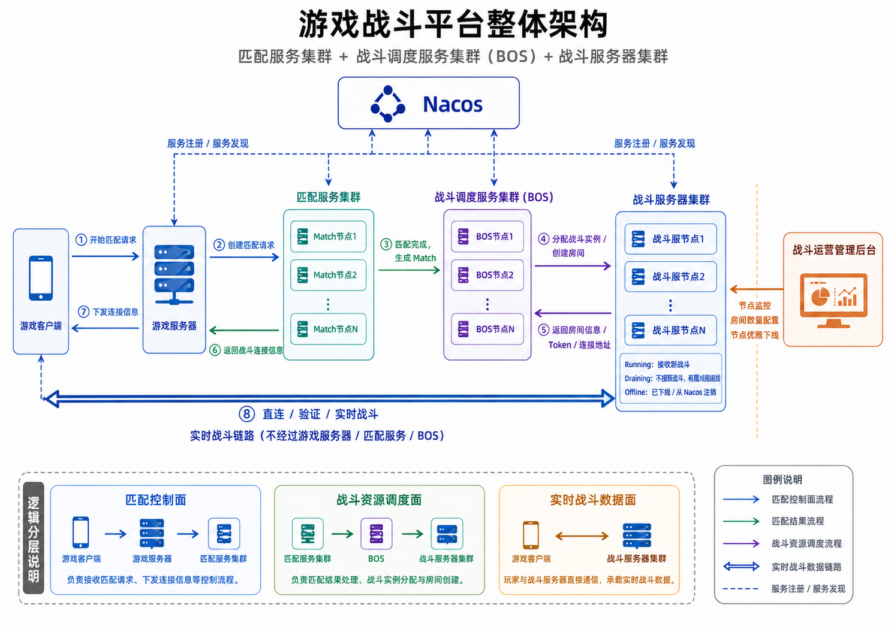
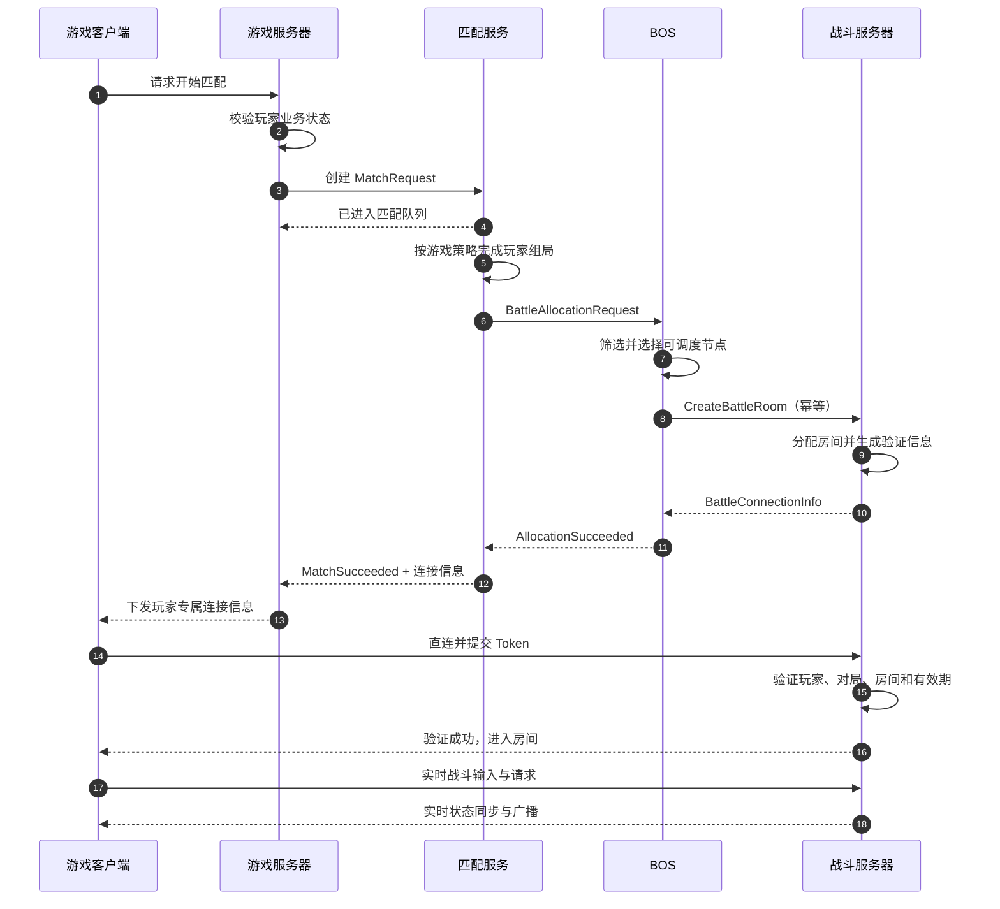
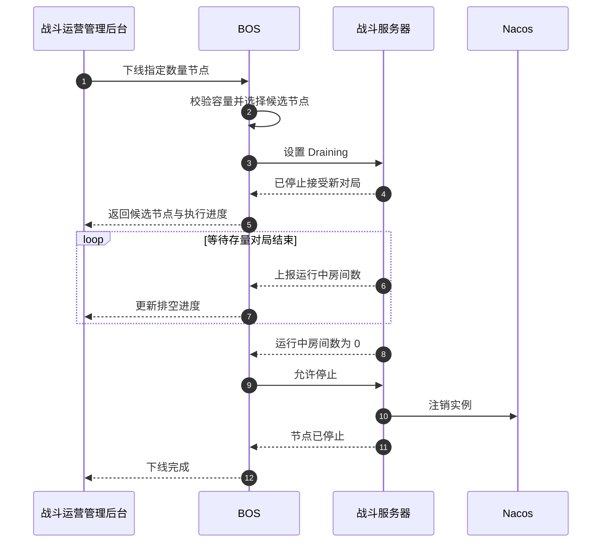
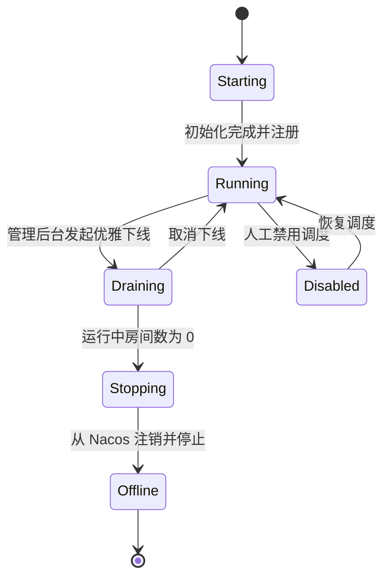

# 游戏战斗平台整体架构说明

> 文档状态：方案设计稿  
> 适用范围：支持多款游戏的统一匹配、战斗资源调度与实时战斗平台  
> 版本：1.0  
> 更新日期：2026-07-24

## 1. 文档概述

### 1.1 背景

平台需要为多款游戏提供统一的战斗基础设施。游戏客户端先通过游戏服务器发起匹配，匹配成功后由平台为本场对局选择合适的战斗服务器、创建房间并生成连接验证信息，最后由游戏客户端直连战斗服务器完成实时对局。

平台同时需要支持：

- 多款游戏、多种模式、多地域和多版本战斗服；
- 匹配服务、战斗调度服务和战斗服务器的集群化部署；
- 基于 Nacos 的服务注册、发现与健康状态感知；
- 战斗服务器节点监控、房间数量调整和指定数量节点的优雅下线；
- 匹配逻辑与战斗资源调度逻辑解耦；
- 控制面与实时战斗数据面分离。

### 1.2 设计结论

本方案采用以下核心职责边界：

```text
匹配服务决定“谁和谁打”
战斗调度服务（BOS）决定“去哪里打”
战斗服务器负责“实际怎么打”
```

平台核心调用链为：

```text
游戏客户端
    → 游戏服务器
    → 匹配服务集群
    → 战斗调度服务集群（BOS）
    → 战斗服务器集群
```

房间创建成功后，连接信息沿控制链路返回游戏客户端；进入战斗后，游戏客户端直接与战斗服务器通信，不经由游戏服务器、匹配服务或 BOS 转发。

### 1.3 设计目标

- 为多款游戏提供统一且可复用的匹配与战斗调度基础设施。
- 隔离游戏业务、玩家匹配、资源调度和实时战斗职责。
- 支持各类服务独立扩容、独立发布和故障隔离。
- 避免单个游戏的复杂匹配规则影响公共战斗资源调度。
- 支持战斗服务器的动态发现、状态监控、容量调整和优雅下线。
- 保证重复请求、超时重试和节点故障场景下不会重复创建有效对局。
- 为后续多地域、自动扩缩容和灰度发布预留扩展空间。

### 1.4 非目标

本文不详细设计以下内容：

- 单款游戏内部的具体战斗逻辑与帧同步/状态同步算法；
- 具体 MMR 公式、组队平衡算法及机器人补位算法；
- 战斗录像、回放、反作弊和战绩结算系统；
- 云厂商或容器平台的具体自动扩缩容实现；
- 各服务的数据库表结构及完整接口字段定义。

## 2. 总体架构

### 2.1 逻辑架构图



### 2.2 平面划分

平台分为四个逻辑平面：

| 平面 | 主要组件 | 职责 |
| --- | --- | --- |
| 游戏接入层 | 游戏客户端、游戏服务器 | 接收玩家请求、执行游戏业务校验、向客户端返回结果 |
| 平台控制面 | 匹配服务、BOS | 完成玩家组局与战斗资源分配 |
| 战斗数据面 | 战斗服务器 | 承载玩家连接和实时战斗 |
| 运维管理面 | Nacos、战斗运营管理后台 | 服务发现、健康检查、监控、配置与节点生命周期管理 |

控制面只处理匹配和战斗创建等低频业务消息。实时战斗流量仅在游戏客户端与战斗服务器之间传输，避免中心服务成为网络瓶颈或单点故障放大器。

## 3. 组件职责

### 3.1 游戏客户端

主要职责：

- 向游戏服务器发起开始匹配、取消匹配等请求；
- 接收战斗服务器地址、对局 ID、房间 ID 和验证 Token；
- 直连指定战斗服务器；
- 提交身份和对局验证信息；
- 验证成功后参与实时战斗；
- 处理连接超时、Token 失效和重连等客户端异常。

游戏客户端不直接参与战斗服务器节点选择，也不通过 BOS 传输实时战斗数据。

### 3.2 游戏服务器

主要职责：

- 接收游戏客户端的匹配请求；
- 校验玩家是否满足进入匹配的游戏业务条件，例如组队状态、体力、门票、禁赛状态等；
- 生成带有 `GameId`、`ModeId`、区域、版本和玩家信息的匹配请求；
- 调用匹配服务并维护玩家的业务状态；
- 处理取消匹配、匹配超时和异常补偿；
- 接收匹配成功及战斗连接信息；
- 将每个玩家对应的连接信息安全地下发给游戏客户端；
- 根据平台事件更新玩家的“匹配中”“进入战斗”“战斗结束”等状态。

游戏服务器不承担大规模匹配队列扫描，也不负责选择具体战斗服务器节点。

### 3.3 匹配服务集群

匹配服务负责玩家级匹配，即确定哪些玩家组成一场对局。

主要职责：

- 按 `GameId` 隔离不同游戏；
- 按 `ModeId`、`RegionId`、版本、队伍类型等维度建立匹配队列；
- 维护玩家或队伍的匹配请求；
- 执行 MMR、等待时间、延迟、阵营平衡、角色组合等匹配规则；
- 支持匹配取消、超时、扩圈、失败重试和重复请求防护；
- 匹配成功后生成完整的 `Match`；
- 将战斗资源申请提交给 BOS；
- 接收 BOS 返回的战斗分配结果，并通知对应游戏服务器。

多游戏场景建议采用“公共匹配框架 + 游戏级匹配策略”：

- 公共框架负责接入、队列、分片、超时、并发、状态、通知和监控；
- 游戏级策略负责具体的 MMR、队伍组合和特殊玩法规则；
- 规则简单的游戏可优先使用配置化策略；
- 规则复杂或规模较大的游戏可使用独立 Match Worker，必要时演进为独立匹配服务。

匹配服务不直接选择战斗服务器节点，不读取高频房间负载，也不操作战斗服务器房间。

### 3.4 战斗调度服务集群（BOS）

原“战斗服务器 Proxy”正式命名为“战斗调度服务”，英文为 `Battle Orchestrator Service`，简称 BOS。

BOS 负责资源级调度，即将已经确定的对局分配到合适的战斗服务器和房间。

主要职责：

- 通过 Nacos 发现并订阅战斗服务器实例；
- 维护可调度战斗服务器的本地状态缓存；
- 根据 `GameId`、模式、区域、版本、协议、容量和发布标签筛选兼容节点；
- 排除不健康、禁用、满载和 `Draining` 节点；
- 根据空闲房间数、CPU、内存、网络和调度权重选择节点；
- 请求目标战斗服务器创建房间；
- 接收房间 ID、连接地址和玩家验证信息；
- 将战斗分配结果返回匹配服务；
- 处理节点超时、创建失败、换节点重试和幂等控制；
- 维护节点的可调度状态和优雅下线状态；
- 向战斗运营管理后台提供调度视图和控制能力。

BOS 不是网络网关，不转发客户端实时战斗流量，也不承载游戏特有的玩家匹配算法。

### 3.5 战斗服务器集群

战斗服务器负责运行实际对局，每个节点可以承载多个房间。

主要职责：

- 启动时向 Nacos 注册节点及静态能力信息；
- 维护房间总数、空闲房间数、运行中房间数和当前玩家数；
- 接收 BOS 的房间创建请求；
- 幂等地分配空闲房间并初始化本场对局；
- 为参战玩家生成短期有效的验证信息；
- 返回连接地址、对局 ID、房间 ID、Token 和有效期；
- 接受游戏客户端直连并完成玩家、对局和房间验证；
- 验证通过后运行战斗逻辑和实时同步；
- 上报节点、房间、玩家和系统资源指标；
- 接收房间数量配置及 `Draining` 等管理指令；
- 在优雅下线期间停止接受新对局，同时继续承载存量对局。

### 3.6 Nacos

Nacos 负责服务注册、服务发现和基础健康检查。

主要职责：

- 保存匹配服务、BOS 和战斗服务器等服务实例；
- 提供可用实例查询和实例变更订阅；
- 感知实例上线、下线及基础健康状态变化；
- 保存适合服务发现使用的低频、静态或准静态元数据。

Nacos 不负责：

- 实时房间负载调度；
- 高频更新当前玩家数或瞬时 CPU；
- 对局创建事务；
- 战斗服务器优雅下线的完整编排。

“Nacos 实例健康”与“BOS 是否允许向该节点创建新对局”是两个不同维度。例如，处于 `Draining` 状态的节点仍然健康并继续服务已有玩家，但 BOS 必须停止向其分配新对局。

### 3.7 战斗运营管理后台

战斗运营管理后台属于运维管理面。

主要职责：

- 查看匹配服务、BOS 和战斗服务器节点状态；
- 查看战斗服务器房间容量和运行情况；
- 查看 CPU、内存、网络、玩家数和对局数等指标；
- 调整全局、游戏级或指定节点的房间数量；
- 选择或自动挑选指定数量的战斗服务器进入优雅下线；
- 查看管理命令执行进度、成功结果和失败原因；
- 管理节点禁用、恢复、灰度标签和调度权重；
- 记录操作人、操作时间、变更内容和执行结果。

管理后台不得绕过 BOS 直接把仍在承载对局的节点强制标记为可安全关闭。紧急强制下线应作为独立的高风险权限，并明确提示会影响现有对局。

## 4. 核心业务流程

### 4.1 服务启动与发现

1. 匹配服务节点启动并注册到 Nacos。
2. BOS 节点启动并注册到 Nacos。
3. 战斗服务器节点启动，完成房间初始化后注册到 Nacos。
4. 游戏服务器从 Nacos 发现匹配服务。
5. 匹配服务从 Nacos 发现 BOS。
6. BOS 从 Nacos 发现战斗服务器，并建立可调度节点缓存。
7. 各消费者订阅实例变更，在节点上下线或健康状态变化时更新本地实例列表。
8. BOS 通过独立状态上报通道获得战斗服务器的实时容量和负载。

### 4.2 匹配、资源分配与进入战斗



流程说明：

1. 游戏客户端向游戏服务器请求开始匹配。
2. 游戏服务器完成游戏业务校验并创建匹配请求。
3. 匹配服务将玩家或队伍放入对应的游戏、模式和区域队列。
4. 匹配服务根据该游戏的策略完成组局并生成 `Match`。
5. 匹配服务向 BOS 申请战斗资源。
6. BOS 筛选并选择一个可调度的战斗服务器节点。
7. 战斗服务器幂等创建房间、初始化对局并生成玩家验证信息。
8. 分配结果由战斗服务器返回 BOS，再由 BOS 经匹配服务返回游戏服务器。
9. 游戏服务器只向每个客户端下发该玩家自己的 Token 和连接信息。
10. 游戏客户端直连战斗服务器并完成验证。
11. 全部玩家就绪或满足游戏定义的开战条件后，战斗服务器开始对局。

> 接口实现也可以采用异步事件通知，但逻辑返回链路和职责边界保持不变。所有异步消息必须携带 `RequestId`、`MatchId` 和可追踪的关联 ID。

### 4.3 客户端验证

客户端连接战斗服务器时至少提交：

- `PlayerId`
- `GameId`
- `MatchId`
- `RoomId`
- `Token`
- 客户端协议版本

战斗服务器至少验证：

- Token 签名是否合法；
- Token 是否过期；
- Token 是否绑定当前玩家、对局和房间；
- 玩家是否属于本场对局；
- 房间是否允许进入；
- 客户端协议版本是否兼容；
- 一次性 Token 是否已被使用；
- 重连 Token 是否符合重连策略。

验证成功后，客户端进入对应房间；后续实时数据不经过游戏服务器、匹配服务或 BOS。

### 4.4 匹配取消与失败

- 尚未匹配成功：匹配服务从队列移除请求并通知游戏服务器。
- 已生成 Match、尚未创建房间：匹配服务撤销分配请求或将其标记为取消。
- 房间已创建、客户端尚未进入：由 BOS 和战斗服务器按超时策略回收空房间。
- 部分客户端进入失败：由具体游戏决定等待、补位、重连或终止对局。
- BOS 调度失败：在资源申请超时前更换兼容节点重试；超过阈值后返回明确失败原因。
- 重复取消或重复回调：各组件按请求 ID 和对局 ID 幂等处理。

## 5. 多游戏支持设计

### 5.1 统一游戏维度

以下对象和接口必须显式携带游戏维度，不能只依赖部署环境或服务名隐式区分：

- `GameId`
- `ModeId`
- `RegionId`
- `QueueId`
- `ClientVersion`
- `BattleServerVersion`
- `ProtocolVersion`
- `Extension`

### 5.2 核心对象

```text
MatchRequest
├── RequestId
├── GameId
├── ModeId
├── RegionId
├── QueueId
├── PartyId
├── PlayerList
├── Mmr
├── ClientVersion
├── EnqueueTime
└── Extension

Match
├── MatchId
├── GameId
├── ModeId
├── RegionId
├── PlayerList
├── TeamList
├── BattleConfig
└── Extension

BattleAllocationRequest
├── RequestId
├── MatchId
├── GameId
├── ModeId
├── RegionId
├── BattleServerVersion
├── ProtocolVersion
├── ExpectedPlayerCount
├── RoomConfig
├── PlayerList
└── Extension

BattleConnectionInfo
├── MatchId
├── RoomId
├── BattleServerId
├── Endpoint
├── PlayerTokens
├── ExpireAt
└── ConnectionParameters
```

### 5.3 隔离策略

平台按以下维度逐步隔离：

1. 队列隔离：不同 `GameId`、模式和区域使用独立逻辑队列。
2. 计算隔离：复杂游戏使用独立 Match Worker。
3. 容量隔离：BOS 按游戏配额、服务器能力标签和房间配额调度。
4. 故障隔离：单个游戏策略异常不得阻塞其他游戏或 BOS 公共调度。
5. 发布隔离：游戏级匹配规则能够独立灰度和回滚。
6. 数据隔离：指标、日志、配置和权限均带 `GameId` 维度。

## 6. 服务注册与发现

### 6.1 建议服务名

| 服务名 | 提供者 | 主要消费者 |
| --- | --- | --- |
| `game-server` | 游戏服务器 | 匹配结果通知方或平台事件消费者 |
| `match-service` | 匹配服务 | 游戏服务器 |
| `battle-orchestrator` | BOS | 匹配服务 |
| `battle-server` | 战斗服务器 | BOS |

服务名描述组件职责，游戏、区域和版本等信息通过分组、命名空间或实例元数据表达，避免为每个临时组合创建不可控的服务名。

### 6.2 战斗服务器实例元数据

适合放入 Nacos 的静态或低频元数据示例：

```text
instanceId
gameIds
regionId
battleServerVersion
protocolVersion
supportedModes
zone
releaseChannel
endpoint
```

以下高频状态不应依赖频繁更新 Nacos 元数据：

```text
freeRoomCount
runningRoomCount
currentPlayerCount
cpuUsage
memoryUsage
networkUsage
```

这些信息由战斗服务器通过状态上报通道发送给 BOS，由 BOS 在内存或专用状态存储中维护最新视图。

### 6.3 状态分离

每个战斗服务器至少同时具有三类状态：

| 状态类型 | 示例 | 用途 |
| --- | --- | --- |
| 服务健康状态 | Healthy / Unhealthy | 表示实例是否存活并可响应 |
| 调度状态 | Available / Full / Draining / Disabled | 表示 BOS 是否可创建新对局 |
| 运行状态 | Starting / Running / Stopping / Offline | 表示节点生命周期阶段 |

典型组合：

```text
健康状态：Healthy
调度状态：Draining
运行状态：Running
允许现有对局继续：是
允许创建新对局：否
```

## 7. BOS 调度设计

### 7.1 调度过程

BOS 采用“硬条件过滤 + 软条件评分”的两阶段调度。

硬条件过滤：

- 节点健康；
- 调度状态为 `Available`；
- 支持目标 `GameId` 和 `ModeId`；
- 区域、战斗服版本和协议版本兼容；
- 不处于禁用或 `Draining` 状态；
- 至少有一个可用房间；
- 满足灰度、专服或租户隔离标签。

软条件评分可综合：

- 空闲房间比例；
- CPU、内存和网络负载；
- 当前玩家数；
- 节点近期房间创建失败率；
- 机房或可用区亲和性；
- 调度权重；
- 同一游戏或版本的资源均衡度。

### 7.2 调度伪流程

```text
接收 BattleAllocationRequest
    ↓
校验 RequestId / MatchId 幂等状态
    ↓
按游戏、模式、区域、版本筛选节点
    ↓
排除 Unhealthy / Full / Draining / Disabled
    ↓
按实时负载评分并选择候选节点
    ↓
请求候选节点幂等创建房间
    ├── 成功：记录分配关系并返回连接信息
    └── 失败：刷新状态并选择下一候选节点
```

### 7.3 幂等与并发

- `RequestId` 标识一次资源申请，`MatchId` 标识一场逻辑对局。
- BOS 对同一 `MatchId` 的重复请求返回已有有效分配，不重复创建房间。
- 战斗服务器的 `CreateBattleRoom` 接口同样按 `MatchId` 幂等。
- BOS 选择节点后，战斗服务器必须原子地预占房间，避免并发超卖。
- 房间创建失败不能只依赖本地计数回滚，应以战斗服务器的最终响应或对账结果为准。
- BOS 超时重试前应查询原请求状态，避免“响应丢失但房间已创建”导致双重分配。

## 8. 运维管理设计

### 8.1 节点监控

管理后台建议展示：

- 节点 ID、地址、区域、可用区和版本；
- 服务健康状态、调度状态和运行状态；
- 房间总数、目标房间数、空闲房间数和运行中房间数；
- 当前玩家数、连接数和对局创建速率；
- CPU、内存、网络和进程运行时长；
- 心跳时间、最后一次状态上报时间；
- 房间创建成功率、失败率和延迟；
- Token 验证失败率和客户端连接失败率；
- 当前承载的游戏、模式和灰度标签。

匹配服务和 BOS 还应展示队列规模、匹配耗时、分配耗时、重试次数及错误率。

### 8.2 房间数量调整

管理后台支持：

- 修改某款游戏或某类战斗服务器的默认房间数量；
- 修改指定节点的目标房间数量；
- 查看目标配置、当前配置和生效进度；
- 查看失败原因并重新下发。

扩大房间数量时：

1. 校验节点资源上限和安全阈值。
2. 下发新的目标房间数。
3. 节点逐步创建或启用额外房间。
4. 节点上报当前值，直至与目标值一致。

缩小房间数量时：

1. 已运行房间不被强制关闭。
2. 节点停止分配超过新上限的空闲房间。
3. 随着存量对局结束，逐步释放多余房间。
4. 当前房间数最终收敛至目标值。

配置至少包含版本号，节点只接受更新版本，避免乱序消息覆盖新配置。

### 8.3 指定数量节点优雅下线

管理后台允许运维人员输入需要下线的节点数量。系统默认优先选择预计最快排空的节点，评分因素包括：

- 运行中房间较少；
- 当前在线玩家较少；
- 对局预计剩余时间较短；
- 不承载稀缺游戏版本或特殊模式；
- 不会破坏区域、版本或游戏的最低容量；
- 节点不存在其他运维锁定任务。

正式执行前应显示候选节点、预计释放容量和操作影响，确认后进入优雅下线。

### 8.4 优雅下线时序



### 8.5 节点状态机



状态约束：

- `Running`：可接收新对局。
- `Draining`：不接收新对局，存量对局继续。
- `Stopping`：没有运行中房间，正在注销和停止。
- `Offline`：实例已下线。
- `Disabled`：节点仍在线，但因运维或异常原因不可调度。

## 9. 高可用与异常处理

### 9.1 组件高可用

- 匹配服务、BOS 和战斗服务器均多节点部署。
- 无状态接入能力通过 Nacos 发现和客户端负载均衡实现。
- 匹配队列按游戏、模式和区域分片，并为分片设置明确的唯一所有者或分布式并发控制。
- BOS 的分配结果和幂等状态需要持久化或使用可靠状态存储，避免节点重启后丢失。
- 战斗服务器定期向 BOS 上报状态；BOS 对过期状态降权或停止调度。
- Nacos 按生产级高可用模式部署，消费者保留短期本地实例缓存以应对注册中心瞬时不可用。

### 9.2 关键故障处理

| 故障场景 | 处理原则 |
| --- | --- |
| 匹配服务节点故障 | 分片转移或请求恢复；避免同一玩家同时出现在多个有效 Match 中 |
| BOS 节点故障 | 依据 `RequestId`、`MatchId` 和持久化分配状态继续或恢复请求 |
| 战斗服务器创建房间超时 | 先查询原请求结果，再决定是否换节点，避免重复房间 |
| 战斗服务器失联 | 立即停止新调度；已有对局按游戏容灾能力处理 |
| Nacos 短时不可用 | 使用本地缓存维持有限服务，并禁止向状态过期的未知节点盲目扩散请求 |
| Token 下发后过期 | 游戏服务器重新申请受控的连接凭证，不重新执行玩家匹配 |
| 部分玩家未连接 | 由游戏策略决定等待、重连、机器人补位或取消 |
| 管理命令下发失败 | 保留期望状态并重试，后台显示当前值与目标值不一致 |

### 9.3 对账与回收

平台需要周期性执行：

- BOS 分配记录与战斗服务器实际房间对账；
- 长时间未进入的空房间回收；
- 已结束对局的分配关系清理；
- 孤儿房间检测；
- `Draining` 节点排空状态检查；
- 配置目标值与节点当前值对账。

## 10. 安全设计

- 客户端只获得自己的玩家 Token，不得获得其他玩家凭证。
- Token 使用不可伪造的签名或服务端随机凭证，并设置较短有效期。
- Token 绑定 `PlayerId`、`GameId`、`MatchId`、`RoomId` 和必要的版本信息。
- 一次性进入凭证与重连凭证采用不同策略。
- 外部连接地址与内部管理地址分离。
- 服务间调用进行身份认证、访问控制和传输加密。
- 管理后台采用角色权限控制；下线、强制停止和容量调整属于高权限操作。
- 所有配置变更和节点操作写入不可抵赖的审计日志。
- 日志不得明文记录完整 Token、密钥或其他敏感凭证。

## 11. 可观测性

### 11.1 核心指标

匹配服务：

- 各游戏/模式匹配队列长度；
- 匹配等待时间 P50/P95/P99；
- 匹配成功率、取消率和超时率；
- 扩圈次数和匹配策略错误率。

BOS：

- 每秒资源申请数；
- 调度耗时 P50/P95/P99；
- 首次调度成功率；
- 节点切换和重试次数；
- 无可用节点次数；
- 幂等命中和重复创建拦截次数。

战斗服务器：

- 房间总数、空闲数、运行数；
- 当前玩家数和连接数；
- 房间创建成功率及耗时；
- Token 验证失败率；
- 战斗异常结束率；
- CPU、内存、网络和事件循环/主线程延迟。

### 11.2 日志与追踪

- 全链路统一携带 `TraceId`、`RequestId` 和 `MatchId`。
- 以 `MatchId` 串联匹配、调度、房间创建、客户端进入和战斗结束事件。
- 关键状态变更使用结构化日志。
- 管理命令使用独立 `OperationId`，便于跟踪批量下线和配置变更。
- 告警需要带上 `GameId`、区域、版本和节点 ID，便于快速定位影响范围。

## 12. 部署与扩展建议

### 12.1 独立扩容

各组件按不同压力模型独立扩容：

```text
匹配服务：按队列规模、匹配计算量和扫描频率扩容
BOS：按每秒新建对局数、候选节点数量和调度计算量扩容
战斗服务器：按并发对局数、在线玩家数和单房间资源消耗扩容
```

### 12.2 多地域

建议每个区域部署完整的匹配执行单元、BOS 和战斗服务器池，并优先在玩家所在区域内闭环调度。跨地域匹配由更上层策略显式决定，不能由 BOS 在资源不足时无约束地自动跨区，以免引入不可控延迟。

### 12.3 自动扩缩容

后续可基于以下指标扩容：

- 可用房间比例低于阈值；
- BOS 资源不足次数持续升高；
- 预计排队对局数超过现有容量；
- CPU、内存或网络持续超过安全线。

缩容必须复用 `Draining` 流程，不直接终止仍有运行中房间的节点。

## 13. 关键架构决策

| 编号 | 决策 | 原因 |
| --- | --- | --- |
| ADR-001 | 从游戏服务器中抽离匹配逻辑，建立匹配服务集群 | 支持多游戏策略、独立扩容与故障隔离 |
| ADR-002 | 不把完整匹配逻辑放入 BOS | 玩家组局与资源调度属于不同领域，变化和压力模型不同 |
| ADR-003 | 将“战斗服务器 Proxy”更名为“战斗调度服务（BOS）” | 其职责是资源编排与节点调度，不是网络代理 |
| ADR-004 | 客户端直连战斗服务器 | 降低实时链路延迟，避免中心服务承载战斗流量 |
| ADR-005 | Nacos 只承载注册发现和低频元数据 | 高频房间与负载状态应由 BOS 的状态通道维护 |
| ADR-006 | 健康状态与可调度状态分离 | `Draining` 节点仍需服务已有玩家，但不得接收新对局 |
| ADR-007 | 战斗服务器采用优雅下线 | 不打断进行中的战斗，并保证容量变化可控 |
| ADR-008 | 所有核心对象显式携带游戏维度 | 支持多游戏、多模式、多区域和多版本隔离 |

## 14. 后续详细设计项

以下内容应在进入开发前形成专项设计：

1. 匹配队列分片、故障转移和恢复机制。
2. 各游戏匹配策略的配置模型及 Match Worker 插件边界。
3. BOS 调度评分公式、状态上报协议和缓存过期策略。
4. 房间创建接口的幂等、超时、重试和对账协议。
5. Token 格式、签发、验证、重连与轮换机制。
6. 匹配结果和战斗分配结果的同步调用或异步事件实现。
7. 战斗服务器房间容量调整的资源安全阈值。
8. 批量优雅下线的容量保护、审批和回滚策略。
9. 多地域部署、跨区匹配和容灾目标。
10. 战斗结束、战绩回传和异常补偿链路。

## 15. 验收要点

- 单个游戏的匹配策略异常不会阻塞其他游戏的 BOS 调度。
- BOS 不包含游戏特有的玩家匹配规则。
- 客户端实时战斗数据不经过游戏服务器、匹配服务或 BOS。
- 重复资源申请不会生成两个有效战斗房间。
- `Draining` 节点不再接收新对局，已有对局不受影响。
- 减少房间数量不会强制关闭正在运行的房间。
- Nacos 不承载高频房间负载更新。
- 所有核心请求、事件和指标均可按 `GameId` 与 `MatchId` 追踪。
- 管理后台可以查看配置目标值、当前值和执行进度。
- 指定数量节点下线前会校验剩余容量，下线过程可观察、可取消并有审计记录。

---

本文档确定了多游戏战斗平台的总体职责边界和核心流程。后续接口、存储、算法和部署细节应以本设计为基础继续细化，避免重新耦合匹配逻辑、资源调度和实时战斗三个领域。
