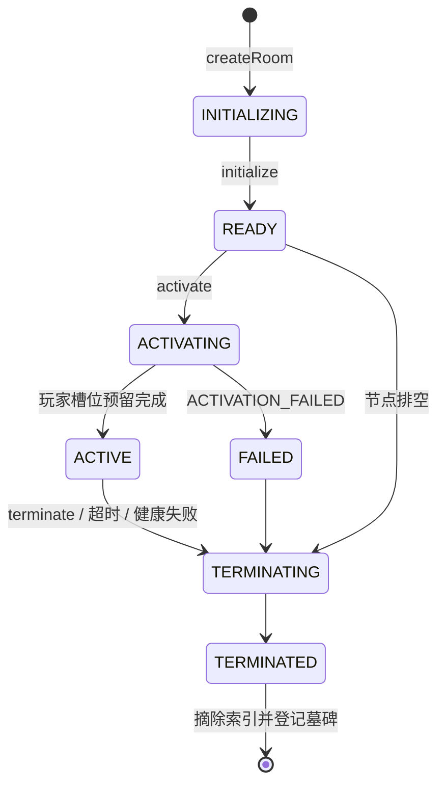

# 房间生命周期

本文档说明一次性逻辑房间的创建、使用、销毁与补位规则。连接如何被路由到房间、以及各阶段运行在哪条线程上，见 [连接路由与线程模型](threading-model.md)；对外接口见 [控制面接口](control-plane.md)，报文格式见 [数据面协议](protocol.md)。

房间是**一次性对象**：`roomId` 不复用，一局结束后运行对象连同连接与帧历史一起销毁，由协调器创建全新房间补位。

## 状态轴

三条正交状态轴，全部只在房间自己的事件循环内变更。

```text
RoomState:   INITIALIZING → READY → ACTIVATING → ACTIVE → TERMINATING → TERMINATED
                                                    └──→ FAILED ───────┘
MatchPhase:  NONE → WAITING_FOR_PLAYERS → RUNNING → FINISHED
PlayerState: RESERVED → CONNECTED ⇄ RECONNECTING → COMPLETED / TIMED_OUT
```

- `RoomState`（[枚举](../src/main/java/com/rainnov/lockstep/room/RoomState.java)）是房间池视角的资源状态。
- `MatchPhase`（[枚举](../src/main/java/com/rainnov/lockstep/room/MatchPhase.java)）是对局视角的业务阶段。
- `PlayerState`（[枚举](../src/main/java/com/rainnov/lockstep/room/PlayerState.java)）是玩家槽位视角。

`ACTIVE` 只表示房间已被占用，此时对局可能仍处于 `WAITING_FOR_PLAYERS` 等待玩家接入，两者不可混用。



## 一、创建：预热而非按需

房间在节点启动时批量预创建，分配请求不会触发新建。

[`RoomPoolLifecycle`](../src/main/java/com/rainnov/lockstep/node/RoomPoolLifecycle.java)（`SmartLifecycle` 阶段 100）调用 `RoomPoolManager.start()`，最多等待 30 秒：

1. `reconcileCapacity()` 计算 `target-size - rooms.size()`，缺多少建多少。
2. 每次 `createRoom()` 生成 `roomId = "room-" + UUID`，从 `RoomEventLoopProvider.next()` 轮询取一条房间线程，构造 [`GameRoom`](../src/main/java/com/rainnov/lockstep/room/GameRoom.java)（此时为 `INITIALIZING`）并写入 `rooms` 索引。
3. `room.initialize()` 在房间线程内把状态推到 `READY`，回调切回协调器后把 `roomId` 追加到 `readyRoomIds` FIFO 队列。
4. 当在建房间数为零、`rooms` 与 `readyRoomIds` 都达到 `target-size` 时，启动 Future 完成，节点标记为 `READY`。

### 容量语义

`lockstep.pool.target-size`（默认 16）是**所有未终止房间的总数**，不是空闲房间目标数。分配一局不会扩容，因此单节点并发对局上限就是该值。

### 创建失败处理

从 `rooms` 移除该房间并触发创建失败监听（计入 `lockstep.room.replacements.failures`），累加 `consecutiveCreationFailures`：

- 未达 `pool.health-failure-threshold`（默认 3）：延迟约 1 秒（`min(health-check-interval, 1s)`）后重试补齐。
- 达到阈值：`beginFatalHealthDrain()`，整个节点进入排空。

## 二、使用

### 分配与激活

`RoomPoolManager.allocate(matchId, players)` 在协调器线程上执行：

1. 校验池已启动、仍接受分配，且 `matchId` 未被占用（`matchToRoom` 与 `pendingMatches` 双查）。
2. `pollReadyRoom()` 从 FIFO 队列取一个仍为 `READY` 的房间。取不到即返回 `ROOM_CAPACITY_EXHAUSTED`，计入 `lockstep.allocations{result=capacity_exhausted}`。
3. 生成 `allocationId`，登记 `pendingActivations`，把 `activate` 投递给房间线程。
4. `activateOnLoop`：`READY → ACTIVATING`，按给定顺序写入玩家槽位（全部 `RESERVED`），置 `matchPhase = WAITING_FOR_PLAYERS`、`state = ACTIVE`，挂上 `room.join-timeout`（默认 60 秒）定时器。激活过程抛异常则立即 `FORCE` 终止并记 `ACTIVATION_FAILED`。
5. 回调切回协调器后再确认一次：若期间节点已开始排空或该房间已被替换，则强制终止并返回 `NODE_DRAINING`；否则建立 `matchToRoom` 索引，分配成功。

[`RoomAllocationService`](../src/main/java/com/rainnov/lockstep/application/RoomAllocationService.java) 在其上叠加 `Idempotency-Key` 幂等层：请求指纹用 SHA-256 比对，同键同请求返回同一结果，同键不同请求报 `IDEMPOTENCY_CONFLICT`。分配成功后为每个玩家单独签发票据。

### 加入与帧推进

全部玩家接入（`allPlayersConnected()`）后进入 `startMatch()`：取消加入超时、广播 `MATCH_STARTED`、挂上 `room.max-duration`（默认 60 分钟）定时器，并排入首个 tick。

`runTick` 每帧的动作：`currentFrame++` → 取出 `pendingInputs[currentFrame]` → 为每个玩家填入输入或 `no_op = true` → 组装 `ServerFrame` → 追加到 `history`（保留 `tick-rate × history-seconds`，默认 1000 帧）→ 广播 → 发布快照 → 排入下一帧。

帧推进不是固定周期任务，而是每帧末尾自续排（默认 `tick-rate = 20`，即 50 ms），同时记录 `lastTickLagNanos` 作为滞后观测值。

### 输入准入

`acceptInputOnLoop` 依次校验：

1. 会话是否为该玩家当前会话（`sessionId` 比对）。
2. 对局是否 `RUNNING`、房间是否 `ACTIVE`。
3. 载荷是否超过 `frame.max-input-bytes`。
4. `targetFrame` 是否落在 `(currentFrame, currentFrame + max-lead-frames]` 区间内。
5. `sequence` 是否为非零 uint32 且相对该玩家单调递增。

同帧同玩家重复提交且序号与载荷完全一致，按 `DUPLICATE_IGNORED` 幂等吞掉；内容不同则 `REJECTED_CONFLICT`。所有拒绝都回一条 `fatal = false` 的 `ProtocolError`，不断开连接。

### 断线与重连

玩家侧连续 `data-plane.connection-idle-timeout`（默认 15 秒）无有效消息即触发 `disconnectOnLoop`：解绑会话、`CONNECTED → RECONNECTING`、递增 `connectionGeneration` 使旧定时器失效、广播 `PLAYER_DISCONNECTED`、挂上 `room.reconnect-grace`（默认 30 秒）定时器。

宽限期内新连接携带 `lastAppliedFrame` 回来，即从 `history` 补发缺失帧并广播 `PLAYER_RECONNECTED`；宽限期耗尽则该玩家置 `TIMED_OUT`，并以 `GRACEFUL` + `RECONNECT_TIMEOUT` 终止**整局**。

### 健康探测

协调器每 `pool.health-check-interval`（默认 10 秒）对每个房间发起一次 `healthCheck()`：

- 房间处于 `ACTIVE + RUNNING` 时，检查距上次 tick 是否超过 `max(4 × tickPeriod, 1s)`。
- 其他状态下只要不是 `FAILED` 或 `TERMINATED` 即视为健康。

连续失败达到 `health-failure-threshold` 时对该房间执行 `fail(HEALTH_CHECK_FAILED)`。若探测本身超时（房间线程完全无响应），直接判定为节点级致命故障并触发全节点排空。

## 三、销毁

### 触发来源

| 终止原因 | 模式 | 触发条件 |
| --- | --- | --- |
| `MATCH_COMPLETED` / `ADMINISTRATIVE` | 请求指定 | 控制面终止接口 |
| `JOIN_TIMEOUT` | `GRACEFUL` | 加入超时内未集齐玩家 |
| `RECONNECT_TIMEOUT` | `GRACEFUL` | 玩家重连宽限期耗尽 |
| `MAX_DURATION` | `GRACEFUL` | 对局达到最长时长上限 |
| `REPLAY_HISTORY_EXPIRED` | `FORCE` | 重连所需历史帧已被淘汰 |
| `INTERNAL_ERROR` | `FORCE` | `currentFrame` 触及 uint32 上限等内部不变式破坏 |
| `ACTIVATION_FAILED` | `FORCE` | 激活过程异常 |
| `HEALTH_CHECK_FAILED` | `FORCE` | 连续健康探测失败 |
| `NODE_DRAINING` | `FORCE` | 节点排空 |

完整取值见 [`TerminationReason`](../src/main/java/com/rainnov/lockstep/room/TerminationReason.java) 与 [`TerminationMode`](../src/main/java/com/rainnov/lockstep/room/TerminationMode.java)。

### 终止流程

`terminateOnLoop` 在房间线程内串行完成，已处于 `TERMINATING` 或 `TERMINATED` 时直接返回，因此天然幂等：

1. 失败路径先置 `FAILED` 并发布一次快照。
2. 置 `TERMINATING`，`matchPhase = FINISHED`，记录终止模式与原因。
3. 取消加入超时、tick、最长时长三个定时器。
4. 仅 `GRACEFUL` 模式广播 `MATCH_TERMINATING` 与 `MATCH_ENDED`。
5. 逐个玩家取消心跳与重连定时器，以 `ROOM_TERMINATED` 关闭会话，非 `TIMED_OUT` 的置为 `COMPLETED`。
6. 清空 `pendingInputs` 与 `history`。
7. 置 `TERMINATED`、发布终态快照，回调终止监听（`terminalCallbackSent` 保证只回调一次）。

`FORCE` 模式不发送结束事件，客户端只观察到 WebSocket 关闭帧。这是「尽快释放资源」与「优雅告知客户端」之间的取舍点。

## 四、补位

终止回调把 `removeRoomOnLoop` 投回协调器线程：

1. 从 `rooms` 摘除，清理 `readyRoomIds` 与健康探测记录。
2. 若仍有未完成的挂起分配，以 `NODE_DRAINING` 或 `ROOM_ACTIVATION_TERMINATED` 使其失败。
3. 移除 `matchToRoom` 索引。
4. 写入**墓碑**，保留 `pool.tombstone-retention`（默认 10 分钟）。保留期内查询或再次终止同一 `roomId` 会返回终态快照而不是 `ROOM_NOT_FOUND`，使控制面重试天然幂等。
5. 通知终止监听：`RoomAllocationService` 清理幂等条目，`RoomMetrics` 记录终止原因，非正常原因额外计入异常终止计数。
6. 若仍接受分配，`reconcileCapacity()` 立即创建一个**全新 `roomId`** 的房间补齐到 `target-size`；若已在排空中则不补位，且 `rooms` 清空时完成排空 Future。

### 索引自愈

健康巡检每轮执行 `checkAndRepairIndexes()`：按 `rooms` 的实际状态重建 `readyRoomIds`、`matchToRoom`、`pendingMatches`，并清理指向不存在房间的挂起分配。若发现 `rooms.size() > target-size`，或索引键与房间自身 `roomId` 不一致，视为不可恢复，直接进入节点级排空。

## 五、排空与节点关闭

`RoomPoolLifecycle.stop()` 先 `beginDraining()`，再 `drain(node.shutdown-grace)`，分三段兜底：

1. 立即停止补位、清空 ready 队列、取消健康巡检，并强制终止所有未被占用的 `READY` / `INITIALIZING` 房间。
2. 宽限期（默认 30 秒）到期后 `forceDrainOnLoop()`，对残余房间全部执行 `FORCE` 终止。
3. 再等约 1 秒后 `hardCleanupDrainOnLoop()`，用合成终态快照直接从索引硬摘除。

第三段保证即使某条房间线程彻底卡死，排空也能在有限时间内完成。数据面监听器处于 `SmartLifecycle` 阶段 0，因此停机顺序为「先排空房间，再关闭监听端口」；`spring.lifecycle.timeout-per-shutdown-phase = 45s` 为整条链路留出余量。

## 六、可观测性

由 [`RoomMetrics`](../src/main/java/com/rainnov/lockstep/observability/RoomMetrics.java) 每秒采样发布：

| 指标 | 含义 |
| --- | --- |
| `lockstep.rooms{state=...}` | 各状态房间数与总数 |
| `lockstep.rooms{state=healthy}` | 健康房间数 |
| `lockstep.allocations{result=...}` | 分配成功 / 容量耗尽次数 |
| `lockstep.room.activation` | 控制面激活时延分布 |
| `lockstep.room.terminations.by.reason{reason=...}` | 按终止原因计数 |
| `lockstep.room.terminations{type=abnormal}` | 非正常终止计数（排除完成、管理性与排空） |
| `lockstep.room.replacements.pending` | 待补位房间数 |
| `lockstep.room.replacement.lag` | 从销毁到池恢复的补位时延 |
| `lockstep.room.replacements.failures` | 补位过程中创建失败次数 |
| `lockstep.tick.lag.seconds` | 所有存活房间中的最大帧滞后 |

## 七、相关配置

| 配置项 | 默认值 | 影响阶段 |
| --- | --- | --- |
| `lockstep.pool.target-size` | 16 | 创建与补位目标总数 |
| `lockstep.pool.room-executor-threads` | 4 | 房间线程数 |
| `lockstep.pool.tombstone-retention` | 10m | 墓碑保留期 |
| `lockstep.pool.health-check-interval` | 10s | 健康巡检周期 |
| `lockstep.pool.health-failure-threshold` | 3 | 房间隔离与致命排空阈值 |
| `lockstep.room.max-players` | 8 | 单房间玩家上限 |
| `lockstep.room.join-timeout` | 60s | 等待玩家接入上限 |
| `lockstep.room.reconnect-grace` | 30s | 重连宽限期 |
| `lockstep.room.max-duration` | 60m | 单局最长时长 |
| `lockstep.room.graceful-termination-timeout` | 5s | 关闭帧刷新上限 |
| `lockstep.frame.tick-rate` | 20 | 帧率 |
| `lockstep.frame.max-lead-frames` | 4 | 输入提交窗口 |
| `lockstep.frame.history-seconds` | 50 | 回放历史长度 |
| `lockstep.node.shutdown-grace` | 30s | 排空宽限期 |
