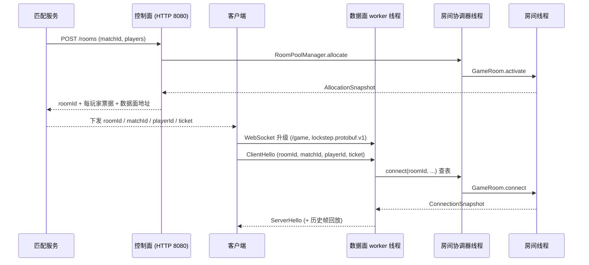

# 连接路由与线程模型

本文档说明客户端连接如何被路由到对应的房间，以及节点内部的线程划分与并发约束。协议报文格式见 [数据面协议](protocol.md)，控制面接口见 [控制面接口](control-plane.md)，房间状态机与销毁补位规则见 [房间生命周期](room-lifecycle.md)。

## 路由链路概览



## 路由的五个阶段

### 1. 分配阶段（控制面）

[`RoomController`](../src/main/java/com/rainnov/lockstep/api/RoomController.java) 接收分配请求后交由 [`RoomAllocationService`](../src/main/java/com/rainnov/lockstep/application/RoomAllocationService.java) 处理，后者调用 [`RoomPoolManager.allocate`](../src/main/java/com/rainnov/lockstep/room/RoomPoolManager.java) 从预热池中取出一个 `READY` 房间并激活。

响应中返回 `roomId`、`matchId`、玩家名单、数据面地址 `advertised-uri`，以及为每个玩家单独签发的票据。票据声明 [`TicketClaims`](../src/main/java/com/rainnov/lockstep/security/ticket/TicketClaims.java) 包含协议版本、`nodeId`、`roomId`、`matchId`、`playerId` 和有效期，由 [`HmacTicketService`](../src/main/java/com/rainnov/lockstep/security/ticket/HmacTicketService.java) 用 HMAC 签名。

### 2. 连接阶段（数据面）

[`NettyDataPlaneServer`](../src/main/java/com/rainnov/lockstep/transport/NettyDataPlaneServer.java) 监听独立端口（默认 9000），每条连接的处理链为：

```
HttpServerCodec
  → HttpObjectAggregator
  → WebSocketServerProtocolHandler   （校验路径 /game 与子协议 lockstep.protobuf.v1）
  → WebSocketFrameAggregator
  → WebSocketDataPlaneHandler        （每连接一个实例，持有该连接的会话状态机）
```

握手完成后连接进入 `AWAITING_HELLO` 状态，并挂上 `authentication-timeout`（默认 5 秒）定时器。

### 3. 认证与路由键校验

[`WebSocketDataPlaneHandler`](../src/main/java/com/rainnov/lockstep/transport/WebSocketDataPlaneHandler.java) 要求首个应用层消息必须是 `ClientHello`，随后：

1. 校验 `Envelope.protocol_version` 与配置一致。
2. 校验 `ClientHello` 的 `roomId` / `matchId` / `playerId` / `ticket` 非空。
3. 验证票据签名与有效期。
4. 将票据声明与 `ClientHello` 字段逐项比对，包含本机 `nodeId`。

因此 `roomId` 虽然由客户端上报，但必须与签名内容完全一致，客户端无法把自己路由到其他房间或其他节点。任何一项不符都返回 `AUTHENTICATION_FAILED` 并关闭连接。

### 4. 房间查表

传输层不直接持有房间引用，而是经 [`RoomCommandGateway`](../src/main/java/com/rainnov/lockstep/transport/RoomCommandGateway.java) 边界接口调用 [`RoomPoolCommandGateway`](../src/main/java/com/rainnov/lockstep/transport/RoomPoolCommandGateway.java)，最终进入 `RoomPoolManager.withLiveRoom(roomId, ...)`。

该方法在**房间协调器线程**上以 `roomId` 查询 `LinkedHashMap<String, GameRoom>` 索引：未命中返回 `ROOM_NOT_FOUND`，命中则把命令投递到该房间自己的事件循环。

### 5. 房间内二次校验与会话绑定

[`GameRoom.connectOnLoop`](../src/main/java/com/rainnov/lockstep/room/GameRoom.java) 在房间线程内继续校验房间状态为 `ACTIVE`、`matchId` 与房间当前对局一致、`playerId` 属于预留名单且未处于 `TIMED_OUT` / `COMPLETED`，然后把 `DataPlaneSession` 绑定到对应的玩家槽位。

同一玩家在新连接上认证成功时，旧会话以 `SESSION_REPLACED` 关闭并原子替换；按 `lastAppliedFrame` 需要补帧时从房间历史队列回放，并以 `CATCH_UP_COMPLETED` 结束。

### 后续消息与出站方向

认证成功后处理器缓存 `roomId`、`playerId`、`sessionId`。之后每条 `ClientInput` / `ClientPing` 携带这一三元组沿相同路径下发（协调器查表 → 房间线程）。房间侧 `requireCurrentSession(playerId, sessionId)` 用 `sessionId` 拒绝已被替换的旧连接写入。

出站方向相反：房间线程构造 `Envelope` 后调用 [`NettyDataPlaneSession.send`](../src/main/java/com/rainnov/lockstep/transport/NettyDataPlaneSession.java)，由它把写操作切回该连接所属的 worker 线程再 `writeAndFlush`。

### 路由键职责

| 标识 | 作用 |
| --- | --- |
| `roomId` | 在房间池索引中定位 `GameRoom` |
| `matchId` | 防止房间被回收复用后，旧票据错投到新对局 |
| `playerId` | 在房间内定位玩家槽位 |
| `sessionId` | 区分同一玩家的多次连接，隔离被替换的旧会话 |

## 线程模型

节点内共有四组互不重叠的线程，跨组一律采用「投递任务 + `CompletableFuture` 回调」，不做阻塞等待。

| 线程组 | 数量 | 职责 | 独占的可变状态 |
| --- | --- | --- | --- |
| Reactor Netty（控制面） | 框架默认 | REST 分配 / 终止 / 查询、健康探针 | `RoomAllocationService` 的幂等与保留索引（此处用 `synchronized` 保护） |
| `lockstep-data-boss` | 1 | 接受数据面连接 | 无 |
| `lockstep-data-worker` | `NioEventLoopGroup(0)`，即 2×CPU | WebSocket 解码、票据校验、认证与心跳定时器、帧写出 | 每个 `WebSocketDataPlaneHandler` 实例字段 |
| `lockstep-room-coordinator` | 1（`DefaultEventExecutor`） | 房间池索引维护、容量补齐、健康巡检、排空 | `rooms` / `readyRoomIds` / `matchToRoom` / `pendingActivations` / `tombstones` |
| `lockstep-room` | `lockstep.pool.room-executor-threads`（默认 4，daemon） | 房间业务：帧推进、输入收集、广播、各类超时 | `players` / `pendingInputs` / `history` / `currentFrame` / `state` / `matchPhase` |

### 房间与线程的绑定

`RoomPoolManager` 创建房间时通过 [`NettyRoomEventLoopProvider.next()`](../src/main/java/com/rainnov/lockstep/room/NettyRoomEventLoopProvider.java) 从 `DefaultEventExecutorGroup` 轮询取出一条 `EventExecutor`，房间终生绑定该线程。

默认配置为 `pool.target-size = 16`、`pool.room-executor-threads = 4`，即每条房间线程承载约 4 个房间。同一线程上的房间是协作式共享，某个房间的长耗时操作会推迟同线程其他房间的帧推进。

### 帧驱动

帧推进不是固定周期任务，而是每个 tick 末尾重新排下一次：`executor.schedule(this::runTick, tickPeriodNanos)`，默认 `frame.tick-rate = 20`（50 ms）。房间用 `nextTickDeadlineNanos` 计算 `lastTickLagNanos` 并写入房间快照，作为帧滞后观测指标。

玩家心跳检查、重连宽限、加入超时、对局最长时长同样是该 executor 上的 `ScheduledFuture`，因此与帧推进天然互斥，无需加锁。

### 同步机制

- `GameRoom.submit(...)`：已在事件循环内则直接执行，否则 `execute` 排队，结果经 `CompletableFuture` 回传。
- `RoomPoolManager.executeCoordinator(...)`：同样模式，保证池索引只有协调器一个写者。
- `volatile RoomSnapshot publishedSnapshot`：房间线程写、协调器与控制面读，支撑免跨线程的 `cachedSnapshot()`。
- `NettyDataPlaneSession` 的 `submissionMonitor` 配合 `AtomicBoolean closing`，保证已受理的写一定排在关闭帧之前。
- 除上述监视器以及 `NettyDataPlaneServer.lifecycleMonitor`、`RoomAllocationService.monitor` 外，房间与池的核心状态全部依赖单线程约束，不使用锁。

### 顺序保证

单条连接的入站顺序由其 worker 线程保序；投递到房间的命令在同一 executor 上串行执行，同样保序。需要显式切回连接线程的只有 `connect` 的完成回调——处理器字段不是线程安全的，因此用 `runOnEventLoop(context, ...)` 把状态机推进搬回 channel 线程。

### 启停顺序

`NettyDataPlaneServer` 处于 `SmartLifecycle` 阶段 0，[`RoomPoolLifecycle`](../src/main/java/com/rainnov/lockstep/node/RoomPoolLifecycle.java) 处于阶段 100。启动时先监听再建池，停机时先排空房间再关监听。监听端口意外关闭时会主动进入排空并最终标记节点终止。

## 已知取舍

- **协调器线程是每条数据面消息的必经环节。** `acceptInput` / `acceptPing` 都经 `withLiveRoom`，即每个输入包都要在单线程协调器上排队完成一次哈希查表。这样池索引只有一个写者，正确性模型最简单，但它构成全节点吞吐的串行段。若需优化，可在认证成功时缓存房间引用或其 `EventExecutor`，让热路径直投房间线程，仅保留分配、终止、巡检走协调器。
- **房间线程数与池容量的比值决定帧抖动的耦合半径。** 房间快照已暴露 `lastTickLagNanos`，可据此判断是否需要提高 `pool.room-executor-threads`。
